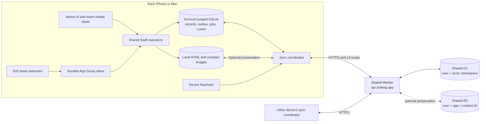

# Arctic sync design

Updated 4 October 2026 · Native auth/v3 trial implemented; live library sync remains dormant.
Reader and Spaced now use the shared service. The dated 3 October schema audit
below describes the legacy Arctic adapter, not the new shared server.

## Decision

Use one shared Swift repository on iOS and macOS, backed by **local SQLite**.
Each user action commits its data and pending upload in the same transaction.
The UI reads local data. Network access never gates launch, reading, or saving.

Use the shared Better Auth account system and Worker at `https://api.zsheng.app`,
owned by `apps/sync-server`. Add the `arctic` namespace to its existing D1 record
streams. Use sync v3 scope `(origin, user ID, namespace, epoch)`; do not carry an
old Arctic v2 cursor or session into this service. Media remains optional and
outside the first integration milestone. [Shared service](../sync-server/README.md).



## What exists and what remains

| Area | Source in this checkout | Required before release |
| --- | --- | --- |
| Native transport | `Sync/`: HTTPS, Keychain, Google handoff, shared cookie and scoped v3 transport | Device Google handoff and cross-device trial; production account lifecycle UI |
| Local sync store | Actor with atomic JSON journal, outbox, clock, cursor, tombstones and persisted v3 identity | SQLite implementation before any live library activation |
| Article bridge | Dormant `ArticleSyncRepository.swift`: metadata, library, tags | Final schemas, granular mutations, migration and UI integration |
| Other user data | Separate annotation/session files; Reader positions in UserDefaults | One account-scoped repository with transactional outbox capture |
| Server | Shared Worker now includes `arctic` and native auth locally; real Better Auth/D1 tests pass | Explicit deployment of additive auth migration/routes, then device auth verification |
| Optional files | Authenticated, SHA-256 verified R2 API | Deferred from core sync; preservation needs durable jobs, portable manifests and bounded restore |

The shared service's [migration evidence](../sync-server/MIGRATION.md) records
the 4 October Reader/Spaced cutover. This review checked source and that report,
not live account data. It does not establish native Arctic sign-in or sync.

The staged JSON journal is not suitable for activation unchanged. Its recorded
10,000-article Release benchmark takes **320 ms for one edit with a full outbox**;
JSON encoding dominates. Projecting one article takes about 0.08 ms. These are
historical Mac measurements, not current iPhone timings. See
[the benchmark](Sync/PERFORMANCE.md).

## Native sign-in and shared-service integration — 4 October

Mobile has a callback URL. It does not need to run a web server. Arctic's iOS
`Info.plist` registers `articles`, and its dormant `NativeGoogleSignIn` uses
`ASWebAuthenticationSession` to receive `articles://auth/callback`. Google
returns to the shared HTTPS server first; that server then returns to the app.

```mermaid
sequenceDiagram
  participant A as Arctic
  participant B as System sign-in sheet
  participant G as Google
  participant S as api.zsheng.app
  A->>A: Create random state and PKCE verifier
  A->>B: Open native start URL with state + verifier hash
  B->>S: /api/arctic/auth/start
  S->>G: Existing Better Auth Google flow
  G->>S: /api/auth/callback/google
  S->>S: Validate login; create one-use code
  S-->>B: articles://auth/callback?code=...&state=...
  B-->>A: System delivers callback and closes sheet
  A->>S: POST /api/arctic/auth/exchange with code + verifier
  S-->>A: Shared account identity + session credential over HTTPS
  A->>A: Store credential in device Keychain
  A->>S: Fetch /api/apps/arctic/sync/v3/state
  A->>S: Pull/push with exact scope and device ID
```

These shared-host native routes are now implemented and tested locally. They
have not been deployed as part of this change.
Google's registered callback remains the shared HTTPS callback. The app callback
is a separate hop, not a URL to register as the Google web client's redirect.
The app carries no Google client secret. State ties the callback to this attempt;
PKCE means the one-use code cannot be exchanged without the app's verifier.
Keep the existing 60-second code expiry, atomic consume, exact callback checks,
and cancellation handling. Never put a reusable credential in a deep link.
[Apple authentication sessions](https://developer.apple.com/documentation/authenticationservices/authenticating-a-user-through-a-web-service),
[native OAuth guidance](https://www.rfc-editor.org/rfc/rfc8252).

The native app uses the same account database, but holds its own session. Safari's
cookie is not automatically available to `URLSession`. The existing exchange
delivers a signed session cookie over HTTPS; Swift stores it in Keychain and
sends it only to the configured API origin. Keep the current ephemeral sign-in
sheet for the first milestone: it avoids reusing/revoking a web app's session,
but may ask the user to sign in again. If browser SSO is added later, mint a
separate native session instead of copying and sharing the browser session.

### Implemented in the native-auth milestone

- **Namespace:** shared routes, health, device and record scoping accept `arctic`.
  Integration tests prove user/app isolation; Arctic file routes return 404.
- **Auth routes:** the shared host reuses the native PKCE handoff and configures
  its `workbench` cookie. Additive migration `0003_native_auth.sql` creates flow
  and code tables. Legacy Reader-hosted native routes keep their old cookie.
- **Transport:** Swift fetches v3 state and sends the exact canonical scope header.
  Each journal persists the full scope as its identity. The transport validates
  this identity before sync; an account/epoch mismatch stops without advancing
  the cursor or clearing pending edits. It never adopts an old v2 journal.
- **Session renewal:** shared middleware forwards refreshed session cookies.
  Real Better Auth/D1 tests cover renewal and revocation. Native tests check
  that cancellation or retirement cannot persist a late credential refresh.
- **Trial UI:** Debug builds expose a separate sample-article profile on iPhone
  and Mac. It is not the app's account UI and does not import ArticleStore.
- **Still required:** a real Google/device trial, SQLite, final record families,
  account lifecycle, granular UI updates, and reviewed migration. The large
  library must not use the trial's whole-file JSON journal.

### Native trial checklist

1. Build **Debug**. On iPhone, open the library's **Sort and filter → Sync trial**.
   On Mac, use **Arctic settings → Sync trial**. Release hides this developer UI.
2. Use an HTTPS host with the shared auth routes and `0003_native_auth.sql`
   applied. Default is `https://api.zsheng.app`; it requires explicit deployment
   before Google sign-in will work. Local tests validate the flow with real D1
   and Better Auth, but substitute a local login for Google's external UI.
3. Continue with Google using a test account. Change the sample title, choose
   **Save sample locally**, then **Sync now**. On the other device, sign in to
   that same account and sync. Confirm that its sample title matches.
4. Quit/relaunch and choose **Restore session**. Repeat offline, edit the sample,
   then reconnect and sync. Revoke the session and confirm that the local sample
   remains while network operations require sign-in. Sign out explicitly when
   done; closing the sheet only cancels its requests.
5. Record the Google callback, Keychain restore, offline edit, both device
   results and revocation. Do not call this production native sync until these
   checks and the storage migration are complete.

Trial files live under Application Support/ArcticSyncTrial, separate from the
library. Their filenames bind server and account; their stored identity also
binds namespace/epoch. An epoch change cannot silently open a fresh journal.
Only the explicit sample metadata at `https://example.com/arctic-sync-trial`
is created. Existing articles, notes, HTML, images and Jev keys are not imported.
Use a test account: trial records are real records on the selected server.

### Validation — 4 October

- Shared Worker: 10 integration tests pass, including native exchange, wrong
  verifier, expired/replayed/revoked grants, session renewal, namespace isolation
  and disabled Arctic file routes. Type check and Wrangler dry-run build pass.
- Swift package: 21 tests pass, including durable scoped profiles, rejected
  resets, retained offline edits and late-cookie cancellation.
- Legacy Arctic server: 10 native-auth integration tests and four route tests pass.
- iOS simulator and Mac Debug builds pass. The focused iOS 27 UI test opens the
  trial, rejects HTTP, closes it, and confirms the local sample library remains.
  This test needs ad-hoc signing for the App Group entitlement; an unsigned
  simulator build cannot create the library fixture.
- Shared browser checks: five pass; the production-restore fixture test is
  intentionally skipped without its separate migration dataset. The first Reader
  desktop attempt hit stale Vite dependencies; its clean retry passes.
- No physical-device Google handoff, Keychain relaunch, or cross-device restore
  is claimed. Those checks require the HTTPS deployment and user sign-in.

### Smallest useful integration milestone

1. Add native auth and the Arctic namespace in an isolated local/staging service.
   Test real Better Auth/D1 code exchange, expiry, replay, wrong verifier/state,
   logout and cross-app isolation. Native browser tests need reachable HTTPS;
   do not weaken the production HTTPS checks to use phone-local `localhost`.
2. Use a disposable native test profile to sign in on iPhone, fetch v3 scope,
   push one article and restore it on Mac. Keep the user's existing stores intact.
   Verify the callback, Keychain persistence, relaunch and session revocation on
   real devices before implementing broad account UI or migrating the library.
3. Add the SQLite repository and record families. Exercise offline edits,
   interrupted batches, account/epoch changes, tombstones and restart recovery
   through the production adapters. Then review the concrete data migration and
   enable it only with separate approval. No deployment or activation is part of
   this design update.

## Local storage and ownership

Keep a separate profile for local-only use and each `(server origin, user ID)`.
All user data, cursors, jobs and private cached content belong to that profile.
An account change must never reuse the old account's database or pending work.

Use SQLite WAL with one serialized writer outside MainActor. Keep transactions
short and do no network work inside them. Start with `synchronous=FULL` for
committed user data; do not trade away durability for a benchmark. Schedule
checkpoint work away from interaction where possible and monitor WAL growth.
SQLite supports concurrent readers with one writer; it does not make main-thread
database work safe. [SQLite WAL](https://www.sqlite.org/wal.html)

| Local table | Purpose |
| --- | --- |
| `records` | Validated values, winning versions, tombstones and server sequence |
| `outbox` | Pending key and submitted version; payload from its record |
| `state` | Profile identity, device identity, hybrid clock, pull cursor, schema version |
| Domain projections | Indexed article, annotation and session queries; updated with records |
| `local_values` | Download receipts, share receipts, retry state and device settings |
| `file_jobs` | Durable upload/download intent, expected hash, retry state and dependency |

Projections are a local query optimization, not a second source of truth. Apply
them in the same transaction as their records. Publish changed IDs to existing
UI caches; do not replace and sort the complete library after each sync page.
An optimistic note can appear at once, but a failed local commit must retain its
draft and show a retry state. “Saved” means locally durable, not uploaded.

## Data and conflict rules

Use the existing deterministic article identity: SHA-256 of the agreed canonical
URL. Freeze normalization across platforms before import. Keep meaningful query
parameters in sync identity; paste cleanup is a separate policy. Preserve legacy
UUID-to-article mappings so annotations, history and UI identity survive. Merge
duplicate canonical URLs deliberately and report any ambiguous collisions.

The existing protocol selects a winner using a hybrid logical clock and device
ID. It is record-level last-write-wins, not collaborative text editing. Split
records by independent intent instead of syncing one large article object.

| Data | Proposed unit and behavior |
| --- | --- |
| Title, subtitle, source URLs | Article metadata record; preview refresh cannot overwrite user state |
| Saved / archived / unsaved | One membership record with an explicit state and original save date; latest version wins |
| Favourite | Separate flag and `favouritedAt`; archive preserves it, unsave clears it; show favourites only for saved membership |
| Read state / history | Separate from membership; retain per-device latest visit and derive the combined history |
| Tags | Stable tag definitions; per-article/per-tag user decision (include, exclude, automatic); separate automatic result with input/category version. User decisions take priority |
| Highlights | Annotation UUID, exact/context anchor and colour; retained deletion marker |
| Notes | Immutable revisions with parent revision IDs and an annotation link. Concurrent branches remain available as “Another version”; no silent text loss |
| Reader position | Article + device checkpoint, content version and text anchor. On open, offer/restore the latest compatible checkpoint; never move an already open page after a pull |
| Reading time | Stable per-device session records; only the originating device updates its session. Sync sessions, derive totals locally |
| Reader content | Immutable body/asset hashes plus a versioned extraction manifest; independent from metadata |

For notes, keep bounded revision metadata in D1 and put large text in private
content-addressed files. Validate the **encoded** record size before queuing.
The current protocol caps each value at 64 KiB. Oversized existing notes must
remain locally readable and gain a file job, never be truncated or block all
other records. Preserve concurrent revision branches before selecting a display
version. A winning annotation deletion hides its revisions; restoration is an
explicit action, not a side effect of receiving an old edit.

Likewise, an article removal marker suppresses older related state. A stale device
must not restore it through a metadata fetch. Unsave and archive are membership
changes, not deletion. Retain tombstones until a separate retention/recovery
protocol exists. A pull can split related records across pages: projections must
tolerate missing parents and must not expose invalid partial combinations.

Preserve the reading-time rules: count qualifying interaction gaps up to 120
seconds; do not add idle gaps beyond that threshold. Weekly article count requires
at least 60 recorded seconds for that article that week. Repeated sync never adds
the same session twice. Genuine simultaneous reading on two devices is summed
and remains an estimate; current records do not contain intervals sufficient to
remove overlap accurately. Preloads and unsaved pages do not start saved-article
reading sessions. See [reading-time rules](../../READING_TIME.md).

Keep Jev keys, credentials, note drafts, theme settings, browser cookies, WebView
history, local paths, download status and shown-toast receipts device-local.
Sync finished automatic tags, not the key or transient tagging requests.

## Offline edit and reconciliation

```mermaid
sequenceDiagram
  participant U as User
  participant L as Local repository
  participant Q as Sync coordinator
  participant S as Authenticated server
  U->>L: Archive, save, tag or edit note
  L->>L: Commit record + projection + outbox atomically
  L-->>U: Saved locally; update affected UI
  Note over L,S: Offline or app quit: pending work stays on disk
  Q->>S: Pull from durable cursor to fixed head
  S-->>Q: Bounded page of versioned records
  Q->>L: Validate; commit winners + projection + cursor
  Q->>S: Push bounded snapshot of pending versions
  S-->>Q: Acknowledgements and winning versions
  Q->>L: Reconcile; clear only matching pending versions
  Note over L,Q: A newer local edit remains queued
```

Pulling remote changes must not create local edits or re-enqueue them. Reuse the
existing checks for page order, fixed head, supported schemas, clock bounds and
acknowledgement versions. Unknown schema, cursor reset or impossible clock state
stops that stream with a recoverable error; it never clears the local library.
Do not discard an outbox to resolve a reset. Recovery needs a verified server
snapshot plus preservation/reconciliation of pending local edits.

Coalesce local triggers for about 500 ms; also run on sign-in, foreground and
connectivity recovery. Start with a 30-second foreground check for other-device
edits. One coordinator owns each account; use bounded backoff with jitter for
transient failures, and pause for sign-in after an authentication failure.

Start with 200-record pull pages and push batches bounded by both count and the
existing 1 MiB encoded request limit (maximum 500 changes). Batch imports in
bounded transactions with durable progress. Network completion and UI publication
are separate: defer bulk visual updates during scrolling, without deferring the
durable commit. Measure and tune these starting values.

iOS background execution is best effort. Save locally first, request time to
finish useful pending work, and resume safely next launch. Do not promise instant
sync while iOS has suspended the app.
[Apple background strategies](https://developer.apple.com/documentation/backgroundtasks/choosing-background-strategies-for-your-app)

## Restore priority and optional downloads

Updated 3 October 2026: core sync restores user records in this order:

1. **Articles:** identity, title, subtitle, source/image URLs, tags, library flags
   and their dates. Make the library usable as each batch commits.
2. **Highlights and notes:** restore full quote text and anchors without waiting
   for the source page or Reader HTML. Retain annotations for unsaved articles.
3. **Reading sessions and positions:** restore history, derive statistics locally,
   and restore compatible Reader checkpoints when the article opens.

This is initial-restore priority, not a reason to delay new user edits behind a
large import. Local writes remain immediate; bounded upload batches must give
new notes and other interactive edits a turn while bulk restore continues.

The current protocol has one sequence-ordered cursor. It cannot guarantee this
family order: do not skip records or advance a cursor past uncommitted records.
Until the backend has a consistent bootstrap snapshot or independent family
streams/cursors, consume each complete page safely, publish available articles
first and keep dependent records pending until their identities are resolved.
Guaranteed network ordering is a transport requirement for the backend handoff,
not a claim about the existing adapter.

**Core sync includes no Reader HTML or image bytes, including tiny previews.**
URLs are metadata. Missing covers use local placeholders; visible covers may
fetch from their source URLs through the normal bounded image pipeline. That
cache activity is independent of sync completion and must not cause a full
library download at sign-in.

Use a separate **Download for offline** action for an article or selection.
An optional device setting can download new saved articles in the background,
with Wi-Fi-only and storage limits. Jobs are durable, resumable and lower
priority than opening an article. Download status stays device-local.

Cloud copies of extracted HTML and compact covers are a separate, optional
preservation feature, disabled by default and outside the first sync milestone.
Background download normally fetches/extracts from the publisher; it is not a
cross-device backup. A changed, removed or restricted source may not reproduce
the original Reader content. Existing local content and annotations remain intact.

## Optional HTML and cover preservation

The following file-transfer design applies only if cloud preservation is enabled.



```mermaid
flowchart LR
  Extract[Extract correct article URL] --> Local[Write immutable local bytes]
  Local --> Job[Commit durable upload job]
  Job --> Upload[Upload and confirm hash]
  Upload --> Manifest[Queue available-content manifest]
  Manifest --> Remote[Other device receives manifest]
  Remote --> Fetch[Fetch visible or requested content]
  Fetch --> Verify[Verify hash and commit local file]
  Verify --> Reader[Open from local content]
```

Metadata sync must proceed even when a body upload fails. A crash after upload
but before manifest commit is harmless: retry by hash. A crash between local
file creation and job commit can leave an orphan file, not a broken published
reference. Keep referenced files while their jobs or manifests need them.

Store portable extracted content, not a styled document containing another
device's file paths. Render with local fonts/theme and resolve manifest asset
IDs through the app's content loader. Keep navigation identity checks: extracting
a followed link must never replace the starting article's stored content.

Start with uncompressed UTF-8 HTML. Current uploads have an 8 MiB file limit;
larger content stays local with a clear pending/unsupported-content state while
metadata continues to sync. Add versioned compression or chunking only after
measuring a representative library. Hash exact stored bytes and verify downloads.

When preservation is enabled, sync one compact cover and its tiny preview;
generate screen-size variants locally. Reuse Arctic's existing ImageIO pipeline,
HEIC/JPEG selection and bounded decoded cache. Do not upload original OG downloads
or every device-specific thumbnail. Keep cover work independent from article saves.

On another device, optional file restoration follows the user-record priorities
above and runs only for visible or requested media and explicit offline jobs.
Begin with two file transfers; pause
speculative work under memory pressure or active reading. Do not fetch every
publisher page at sign-in. A local Downloaded tab describes files on this device;
cloud availability is a separate state. Complete offline article media is not
guaranteed until all required manifest assets exist locally.

Keep files private behind authenticated routes. R2 provides strongly consistent
object reads after writes, but D1 and R2 do not form one transaction; the durable
job and publish-after-upload rule bridge that boundary. Do not delete remote
objects automatically in the first release.
[R2 consistency](https://developers.cloudflare.com/r2/reference/consistency/)

## Sign-in, profiles and sharing

Reuse the existing Google browser flow (`ASWebAuthenticationSession`) and optional
email/password flow. Google returns to the server; the native callback contains
only a short-lived code and state. Exchange it with the verifier over HTTPS, then
save the credential in device-only Keychain before selecting the account profile.
Do not put tokens in URLs or sync records. The server derives ownership from the
authenticated user, never from a client-supplied account field.

On first sign-in, offer **Merge this device's library** with counts. Keep the
local-only profile intact and make the import resumable/idempotent. Pull existing
account records first so remote deletions are respected. Show conflicting note
versions rather than choosing an arbitrary winner. Sync a new device through the
same account profile; do not silently upload its unrelated local-only library.

Sign-out retires and awaits the old transport before clearing credentials. An
account-generation guard also blocks old tasks from publishing UI/cache results.
Keep that profile offline unless the user explicitly chooses to remove its local
copy; do not expose it in another account. Failed remote logout must not be
reported as successful server revocation.

The share extension keeps its durable App Group inbox. Add the destination profile
ID to each save and tag-result event at creation. The main app atomically imports
the event, marks its receipt and queues sync, then removes the inbox file. A
crash/replay cannot duplicate the save or tagging toast. Account switches cannot
redirect an old event to a new user. Legacy events without a profile need explicit
attribution during migration. The extension does not need server credentials.

Settings shows **On this device**, **Syncing**, **Up to date**, **Waiting for
connection**, or **Sign in again**. Metadata completion and remaining file work
are distinct. A stale last-success time must not imply all devices are current.
Transport is HTTPS and storage is access-controlled; this design is not end-to-end
encrypted. End-to-end encryption would need a separate key recovery design.

## Rollout and checks

1. **Auth and protocol trial.** Complete the disposable-profile iPhone/Mac
   milestone above against the shared host in staging. Verify callback delivery,
   Keychain persistence and v3 account/namespace/epoch isolation first.
2. **Storage and contract, isolated.** Implement SQLite under the existing Swift
   API. Finalize the record families and shared platform codecs. Port transaction,
   tombstone, account and concurrent-edit tests. Do not change the active store.
3. **Concrete local migration, opt-in.** Inventory articles, annotations, sessions,
   positions, inbox receipts and file references. Make a consistent backup; briefly
   gate mutations while copying into a separate profile database. Verify counts,
   identities, dates, text and hashes, then commit a completion marker and switch
   the active profile atomically. Leave legacy sources intact. Interrupted copy
   resumes or retries without touching them. After new writes, rollback requires
   reconciliation/export, not reopening a stale legacy file.
4. **Local two-client integration.** Run two isolated clients against the actual
   Worker routes and local D1/R2. Test offline edits, restart, reconnect, conflicts,
   auth expiry, note overflow, file failure and share-inbox replay. Add Mac package
   wiring and test the same cases on both app targets.
5. **Server pilot.** Verify shared resources and account/OAuth configuration;
   back up before applying additive native-auth migrations to the shared service.
   Preserve existing Reader/Spaced records and test their sign-in/sync paths after
   deployment. Verify native sign-in with a disposable account before importing
   a personal Arctic library. No second Reader/Spaced data cutover is required.
6. **Device pilot.** Enable the approved migration, connect iPhone and Mac, verify
   cross-device edits and offline reopen, then expand adoption after performance
   and recovery checks pass.

The active migration remains gated by the prior approval restriction and
[Arctic's agent instructions](AGENTS.md). This proposal does not activate it.

Acceptance checks must cover:

- Kill/relaunch between local commit, upload, server acceptance and acknowledgement.
  No lost user edit, duplicate note, false completed upload or repeated share toast.
- Archive on one device while favouriting on another; concurrent note edits;
  deletion while another device remains offline; explicit restoration.
- Account A request completes after switching to B; no data, cookie or UI leakage.
- Schema mismatch, disk full, hash mismatch, clock skew, server reset and revoked
  session preserve local data and expose a recoverable state.
- Cold launch with no network still shows the local library and opens cached HTML.
- With media transfer disabled, article, annotation and session sync completes;
  missing images/HTML do not block notes, statistics or new local edits.
- Interrupted offline-download jobs resume without re-importing user records.
- Mixed-family pull pages never lose records when publishing articles first.
- 1,000/10,000 article import and one-record edits, measured on Mac and a physical
  iPhone. Initial target: p95 durable one-record commit below 50 ms off MainActor;
  UI publication fits the 8.33 ms frame budget. These are targets, not results.
- Instruments traces while scrolling, opening articles and receiving a large pull.
  Reuse existing frame diagnostics; report p95/p99 commit/publication times and
  hitches, not only average FPS. Fixture servers keep tests off publisher sites.

## Review map

Read this proposal, then [native storage evidence](Sync/PERFORMANCE.md), then
[auth/backend contracts](../../packages/arctic-sync-server/README.md).
Implementation starts in `Sync/`, continues through
`Sources/ArticleSyncRepository.swift` and the three live stores, then app account
UI and lifecycle wiring. Shared principles remain in [Local-first](../../LOCAL_FIRST.md)
and [UI performance](../../UI_PERFORMANCE.md).

## Current schema audit — 3 October 2026

This section describes the checked-in code and a read-only sample of the local
Mac library. It does not verify production deployment or activate sync. Use this
section for backend consolidation; the earlier sections remain the target design.

### Running app: current local records

Paths below are relative to `Application Support/ArticleReader` unless stated.

| Record | Storage | Fields and ownership |
| --- | --- | --- |
| Article | `links.json`, one array of `SavedArticle` | UUID, URL, title, subtitle, tagging excerpt, image/favicon URLs; saved/read/archive/favourite flags; saved, favourite, visit, preview-fetch and download dates; tags, tagging state; share-transfer and import-batch IDs |
| Tagging state | Inside each article | Generation, pending/completed input identities, automatic/manual/rejected tags and share-feedback receipt. No Jev key |
| Highlight or note | `Annotations/<UUID>.json` | UUID, article URL, optional quote (`exact`, `prefix`, `suffix`, UTF-16 `start` hint), note, highlight flag/colour, created/updated/deleted dates. `deletedAt` is a tombstone |
| Reading session | `ReadingSessions/<UUID>.json` | UUID, article URL, start/update dates, accumulated seconds. Persist sessions; derive stats rather than syncing totals |
| Reader position | UserDefaults `reader-position.<SHA256(raw URL)>` | Block index, text anchor, fraction within block, document progress. Currently no timestamp/device version for cross-device ordering |
| Downloaded Reader | `Downloads/<article UUID>.html` | Separate UTF-8 HTML; can include base64 image data. File presence and `downloadedAt` are device-local |
| iOS preview images | `Images/` | URL-hashed compact raster, 24px preview, and regenerable display derivatives. Bounded cache, not authoritative user data |
| Mac preview images | `Caches/ArcticMacThumbnails-640/` | URL-hashed 640px JPEG/PNG derivatives; independent from the iOS image cache |

Sources: [articles](Sources/ArticleStore.swift), [annotations](Sources/AnnotationStore.swift),
[sessions](Sources/ReadingSessions.swift), [positions](Sources/ReaderPosition.swift),
[iOS images](Sources/LibrarySearch.swift), [Mac images](Mac/MacLibrary.swift).

### Implemented but dormant article adapter

`ArticleSyncRepository` is not called by the live `ArticleStore`. Its schema-v1
codec accepts exactly three record families, each keyed by SHA-256 of the
canonical URL. Canonicalization lowercases scheme/host, removes default ports
and fragment, supplies `/` for an empty path, and **retains query strings**.

| Key | JSON value |
| --- | --- |
| `article/<hash>` | `url`, `title`, `subtitle`, optional `taggingText`, remote `imageURL`, remote `faviconURL` |
| `library/<hash>` | `url`, `saved`, `archived`, optional `favourite`, `read`, optional `savedAt`, `lastVisitedAt`, `importBatchID` |
| `tags/<hash>` | `url`, `names`, `generation`, `automatic`, `manual`, `rejected`, optional `completedIdentity` |

The adapter keeps download dates, failed-preview state, file URLs and share
receipts in private local values. Pending network/tagging work and credentials
are not sync records. Important gaps: **`favouritedAt` is omitted** from the
current library record, and annotation, session, position and content/image
manifest families are not accepted by the codec. They must be added deliberately;
the earlier suggested families in the server README are not implemented schemas.
Splitting three records prevents preview refresh from overwriting tags, but all
library flags still share one last-write-wins record. Independent concurrent
archive/favourite/read edits can therefore overwrite each other.

Sources: [codec and repository](Sources/ArticleSyncRepository.swift),
[journal](Sync/Sources/ArcticSync/SyncStore.swift).

### Server record envelope and files

The checked-in Reader Worker mounts `/api/arctic/sync/v2` with the generic
`packages/local-sync` routes, Better Auth identity and a separate `ARCTIC_DATABASE`.
The record table is:

```sql
sync_records (
  server_seq INTEGER PRIMARY KEY AUTOINCREMENT,
  user_id TEXT NOT NULL,
  key TEXT NOT NULL,
  value TEXT NOT NULL, -- JSON encoded as a string
  schema_version INTEGER NOT NULL,
  hlc_wall_time_ms INTEGER NOT NULL,
  hlc_counter INTEGER NOT NULL,
  device_id TEXT NOT NULL,
  is_deleted INTEGER NOT NULL
)
-- UNIQUE (user_id, key); INDEX (user_id, server_seq)
```

One winning row is retained per user/key; a winning update gets a new server
sequence. Conflict order is `(HLC wall time, HLC counter, device ID)`. Pull uses
a cursor and fixed head, up to 500 records per page. Push is bounded by 500
changes and a 1 MiB request body; each JSON value is at most 64 KiB. A tombstone
uses the same envelope. This is record-level LWW, not a note-text CRDT.

Private files use `/api/arctic/files/sha256:<hex>` and R2 keys
`arctic/v1/users/<encoded user ID>/sha256:<hex>`. Uploads verify the hash and have
an 8 MiB limit. The current file API serves inert binary attachments and does
not implement an image manifest or a compression format. Store bytes before
publishing their reference; do not block metadata sync on files.

For a unified backend, isolation must include **app namespace + authenticated
user + record key**, with a matching namespace boundary for cursors and files.
The current separate D1 database supplies Arctic's app boundary; removing that
boundary without replacing it would mix incompatible record streams. The SQL
above has no `app_id` column today. Keep transport envelopes distinct from each
app's record-value schemas.

Sources: [D1 migration](../../packages/arctic-sync-server/migrations/0001_records.sql),
[Arctic routes](../../packages/arctic-sync-server/routes.ts),
[generic limits](../../packages/local-sync/src/protocol.ts).

### Image dimensions and bytes

**Dimensions are maximum long edges, preserving aspect ratio.** iOS masters are
at most 1,200px: opaque images use HEIC quality 0.7 if available and smaller than
JPEG quality 0.8; transparency uses PNG. Small SVG favicons up to 256,000 bytes
are an exception. New raster downloads do not retain publisher originals.
Legacy cache files remain readable, so this is not a guarantee that every old
cache entry has been re-encoded.

| iOS representation | Encoding / purpose |
| --- | --- |
| 1,200px master | HEIC/JPEG/PNG, regenerable source for local display sizes |
| 960px | JPEG/PNG library card derivative |
| 256px | JPEG/PNG search/history derivative |
| 96px | JPEG/PNG icon derivative |
| 24px | JPEG quality 0.4 or PNG, blurred immediate preview |
| 192px display | Clipboard display decode; not a separately persisted derivative |

iOS compressed masters and derivatives share a 128,000,000-byte trim target.
Decoded images have a 32 MiB / 96-entry NSCache limit; tiny decoded previews have
a separate 1 MiB / 256-entry limit. Cache limits are eviction targets, not
reserved RAM or guarantees. At 960 × 720 × 4 bytes, a card costs about 2.64 MiB
decoded; 32 MiB fits roughly 12 such cards before overhead. Byte size on disk is
not decoded memory size. Mac has a separate 48 MiB decoded-thumbnail cache.

**Measured local Mac sample, 3 October 2026:** 247 cached 640px OG derivatives,
187 JPEG and 60 PNG; 17,599,151 bytes total (16.8 MiB), median 49,889 bytes
(48.7 KiB), P90 150,057 bytes (146.5 KiB), maximum 393,202 bytes (384 KiB).
This is the existing Mac cache, not an iPhone measurement or a complete-library
image inventory. Only files and aggregate sizes were read; no downloads occurred.

The existing controlled iOS-codec photograph benchmark is 57,818 bytes for the
1,200 × 900 HEIC master and 1,227 bytes for its 24 × 18 preview. These are one
photograph's results, not a median. [Codec](Sources/PreviewImageCodec.swift),
[benchmark](PERFORMANCE.md).

For scale, the same Mac library has 461 article records in a 741,063-byte index;
8 annotation files total 3,168 bytes; 128 session files total 27,292 bytes;
31 downloaded HTML files total 955,057 bytes (median 29,209; max 112,510).
Those small note/HTML samples are not capacity limits; embedded images can make
HTML much larger. Dates use the current Swift Codable representation, not an
assumed ISO-8601 wire format; version any conversion explicitly.

### Fast-sync recommendation for consolidation

1. Restore articles first, then highlights/notes, then sessions and versioned
   positions. Include article metadata, membership, independent favourite/read
   state and tags. Do not replicate derived statistics or local download state.
   Respect the cursor constraints in [restore priority](#restore-priority-and-optional-downloads).
2. Keep core sync independent of all image and HTML bytes. Fetch visible covers
   from source URLs through the normal cache pipeline; do not download the whole
   library at sign-in. Generate local display variants rather than syncing them.
3. Offer separate, resumable offline-download jobs for selected articles and an
   optional background-download setting. These fetch source content unless an
   optional preserved cloud copy exists.
4. Defer cloud media preservation from the first milestone. If enabled later,
   transfer compact covers and HTML by content hash with versioned manifests;
   never embed full images in 64 KiB records or resend them with tag edits.
5. Use transactional SQLite records + outbox + cursor locally before live
   integration. The dormant JSON journal encodes its whole snapshot per change:
   its historical 10,000-article Release edit cost was 320 ms with a full outbox.
   Faster transport cannot fix that local write cost. [Evidence](Sync/PERFORMANCE.md).

A first sync should make the library usable from metadata immediately, followed
by annotations and reading history. It can complete without transferring any
media. Later sync transfers changed records only. Credentials and Jev keys stay
in device Keychain. This audit makes no storage migration or deployment changes.
