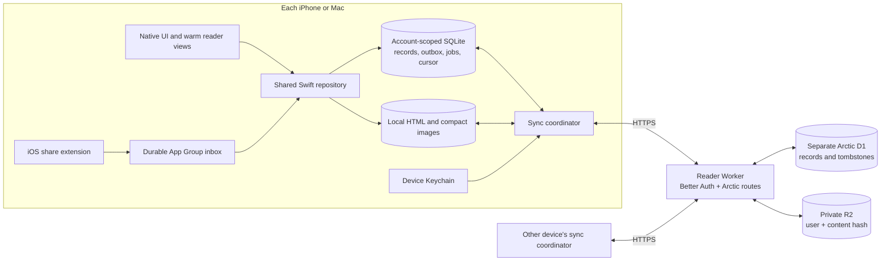

# Arctic sync design

28 September 2026 · Proposal, not an enabled migration or deployed service.

## Decision

Use one shared Swift repository on iOS and macOS, backed by **local SQLite**.
Each user action commits its data and pending upload in the same transaction.
The UI reads local data. Network access never gates launch, reading, or saving.

Reuse the existing Better Auth account system, Cloudflare Worker, record protocol,
and private R2 file routes. Give Arctic its own D1 stream. Keep these boundaries
if Workbench later extracts the routes into a shared sync service; that extraction
does not need to block Arctic. This checkout has no `apps/sync-server` host.



## What exists and what remains

| Area | Source in this checkout | Required before release |
| --- | --- | --- |
| Native transport | `Sync/`: HTTPS, account credentials, Google browser handoff, record sync, verified file transfers | App account UI and lifecycle wiring on both platforms |
| Local sync store | Actor with atomic JSON journal, outbox, clock, cursor and tombstones | SQLite implementation; retain its correctness contracts |
| Article bridge | Dormant `ArticleSyncRepository.swift`: metadata, library, tags | Final schemas, granular mutations, migration and UI integration |
| Other user data | Separate annotation/session files; Reader positions in UserDefaults | One account-scoped repository with transactional outbox capture |
| Server | `packages/arctic-sync-server`, hosted by Reader Worker | Verify actual deployed resources, migrate Arctic tables, deploy and test native auth |
| Files | Authenticated, SHA-256 verified R2 API | Durable upload jobs, portable content manifests and bounded restore |

The backend README records an earlier undeployed state. **Production deployment,
database contents and current OAuth configuration were not inspected for this
design.** Source code alone does not establish that sync works in production.

The staged JSON journal is not suitable for activation unchanged. Its recorded
10,000-article Release benchmark takes **320 ms for one edit with a full outbox**;
JSON encoding dominates. Projecting one article takes about 0.08 ms. These are
historical Mac measurements, not current iPhone timings. See
[the benchmark](Sync/PERFORMANCE.md).

## Local storage and ownership

Keep a separate profile for local-only use and each `(server origin, user ID)`.
All user data, cursors, jobs and private cached content belong to that profile.
An account change must never reuse the old account's database or pending work.

Use SQLite WAL with one serialized writer outside MainActor. Keep transactions
short and do no network work inside them. Start with `synchronous=FULL` for
committed user data; do not trade away durability for a benchmark. Schedule
checkpoint work away from interaction where possible and monitor WAL growth.
SQLite supports concurrent readers with one writer; it does not make main-thread
database work safe. [SQLite WAL](https://www.sqlite.org/wal.html)

| Local table | Purpose |
| --- | --- |
| `records` | Validated values, winning versions, tombstones and server sequence |
| `outbox` | Pending key and submitted version; payload from its record |
| `state` | Profile identity, device identity, hybrid clock, pull cursor, schema version |
| Domain projections | Indexed article, annotation and session queries; updated with records |
| `local_values` | Download receipts, share receipts, retry state and device settings |
| `file_jobs` | Durable upload/download intent, expected hash, retry state and dependency |

Projections are a local query optimization, not a second source of truth. Apply
them in the same transaction as their records. Publish changed IDs to existing
UI caches; do not replace and sort the complete library after each sync page.
An optimistic note can appear at once, but a failed local commit must retain its
draft and show a retry state. “Saved” means locally durable, not uploaded.

## Data and conflict rules

Use the existing deterministic article identity: SHA-256 of the agreed canonical
URL. Freeze normalization across platforms before import. Keep meaningful query
parameters in sync identity; paste cleanup is a separate policy. Preserve legacy
UUID-to-article mappings so annotations, history and UI identity survive. Merge
duplicate canonical URLs deliberately and report any ambiguous collisions.

The existing protocol selects a winner using a hybrid logical clock and device
ID. It is record-level last-write-wins, not collaborative text editing. Split
records by independent intent instead of syncing one large article object.

| Data | Proposed unit and behavior |
| --- | --- |
| Title, subtitle, source URLs | Article metadata record; preview refresh cannot overwrite user state |
| Saved / archived / unsaved | One membership record with an explicit state and original save date; latest version wins |
| Favourite | Separate flag and `favouritedAt`; archive preserves it, unsave clears it; show favourites only for saved membership |
| Read state / history | Separate from membership; retain per-device latest visit and derive the combined history |
| Tags | Stable tag definitions; per-article/per-tag user decision (include, exclude, automatic); separate automatic result with input/category version. User decisions take priority |
| Highlights | Annotation UUID, exact/context anchor and colour; retained deletion marker |
| Notes | Immutable revisions with parent revision IDs and an annotation link. Concurrent branches remain available as “Another version”; no silent text loss |
| Reader position | Article + device checkpoint, content version and text anchor. On open, offer/restore the latest compatible checkpoint; never move an already open page after a pull |
| Reading time | Stable per-device session records; only the originating device updates its session. Sync sessions, derive totals locally |
| Reader content | Immutable body/asset hashes plus a versioned extraction manifest; independent from metadata |

For notes, keep bounded revision metadata in D1 and put large text in private
content-addressed files. Validate the **encoded** record size before queuing.
The current protocol caps each value at 64 KiB. Oversized existing notes must
remain locally readable and gain a file job, never be truncated or block all
other records. Preserve concurrent revision branches before selecting a display
version. A winning annotation deletion hides its revisions; restoration is an
explicit action, not a side effect of receiving an old edit.

Likewise, an article removal marker suppresses older related state. A stale device
must not restore it through a metadata fetch. Unsave and archive are membership
changes, not deletion. Retain tombstones until a separate retention/recovery
protocol exists. A pull can split related records across pages: projections must
tolerate missing parents and must not expose invalid partial combinations.

Preserve the reading-time rules: count qualifying interaction gaps up to 120
seconds; do not add idle gaps beyond that threshold. Weekly article count requires
at least 60 recorded seconds for that article that week. Repeated sync never adds
the same session twice. Genuine simultaneous reading on two devices is summed
and remains an estimate; current records do not contain intervals sufficient to
remove overlap accurately. Preloads and unsaved pages do not start saved-article
reading sessions. See [reading-time rules](../../READING_TIME.md).

Keep Jev keys, credentials, note drafts, theme settings, browser cookies, WebView
history, local paths, download status and shown-toast receipts device-local.
Sync finished automatic tags, not the key or transient tagging requests.

## Offline edit and reconciliation

```mermaid
sequenceDiagram
  participant U as User
  participant L as Local repository
  participant Q as Sync coordinator
  participant S as Authenticated server
  U->>L: Archive, save, tag or edit note
  L->>L: Commit record + projection + outbox atomically
  L-->>U: Saved locally; update affected UI
  Note over L,S: Offline or app quit: pending work stays on disk
  Q->>S: Pull from durable cursor to fixed head
  S-->>Q: Bounded page of versioned records
  Q->>L: Validate; commit winners + projection + cursor
  Q->>S: Push bounded snapshot of pending versions
  S-->>Q: Acknowledgements and winning versions
  Q->>L: Reconcile; clear only matching pending versions
  Note over L,Q: A newer local edit remains queued
```

Pulling remote changes must not create local edits or re-enqueue them. Reuse the
existing checks for page order, fixed head, supported schemas, clock bounds and
acknowledgement versions. Unknown schema, cursor reset or impossible clock state
stops that stream with a recoverable error; it never clears the local library.
Do not discard an outbox to resolve a reset. Recovery needs a verified server
snapshot plus preservation/reconciliation of pending local edits.

Coalesce local triggers for about 500 ms; also run on sign-in, foreground and
connectivity recovery. Start with a 30-second foreground check for other-device
edits. One coordinator owns each account; use bounded backoff with jitter for
transient failures, and pause for sign-in after an authentication failure.

Start with 200-record pull pages and push batches bounded by both count and the
existing 1 MiB encoded request limit (maximum 500 changes). Batch imports in
bounded transactions with durable progress. Network completion and UI publication
are separate: defer bulk visual updates during scrolling, without deferring the
durable commit. Measure and tune these starting values.

iOS background execution is best effort. Save locally first, request time to
finish useful pending work, and resume safely next launch. Do not promise instant
sync while iOS has suspended the app.
[Apple background strategies](https://developer.apple.com/documentation/backgroundtasks/choosing-background-strategies-for-your-app)

## HTML, covers and restore

```mermaid
flowchart LR
  Extract[Extract correct article URL] --> Local[Write immutable local bytes]
  Local --> Job[Commit durable upload job]
  Job --> Upload[Upload and confirm hash]
  Upload --> Manifest[Queue available-content manifest]
  Manifest --> Remote[Other device receives manifest]
  Remote --> Fetch[Fetch visible or requested content]
  Fetch --> Verify[Verify hash and commit local file]
  Verify --> Reader[Open from local content]
```



Metadata sync must proceed even when a body upload fails. A crash after upload
but before manifest commit is harmless: retry by hash. A crash between local
file creation and job commit can leave an orphan file, not a broken published
reference. Keep referenced files while their jobs or manifests need them.

Store portable extracted content, not a styled document containing another
device's file paths. Render with local fonts/theme and resolve manifest asset
IDs through the app's content loader. Keep navigation identity checks: extracting
a followed link must never replace the starting article's stored content.

Start with uncompressed UTF-8 HTML. Current uploads have an 8 MiB file limit;
larger content stays local with a clear pending/unsupported-content state while
metadata continues to sync. Add versioned compression or chunking only after
measuring a representative library. Hash exact stored bytes and verify downloads.

Sync one compact cover representation and its tiny preview when available;
generate screen-size variants locally. Reuse Arctic's existing ImageIO pipeline,
HEIC/JPEG selection and bounded decoded cache. Do not upload original OG downloads
or every device-specific thumbnail. Keep cover work independent from article saves.

On another device: restore metadata first, visible covers next, then requested
Reader content and nearby candidates. Begin with two file transfers; pause
speculative work under memory pressure or active reading. Do not fetch every
publisher page at sign-in. A local Downloaded tab describes files on this device;
cloud availability is a separate state. Complete offline article media is not
guaranteed until all required manifest assets exist locally.

Keep files private behind authenticated routes. R2 provides strongly consistent
object reads after writes, but D1 and R2 do not form one transaction; the durable
job and publish-after-upload rule bridge that boundary. Do not delete remote
objects automatically in the first release.
[R2 consistency](https://developers.cloudflare.com/r2/reference/consistency/)

## Sign-in, profiles and sharing

Reuse the existing Google browser flow (`ASWebAuthenticationSession`) and optional
email/password flow. Google returns to the server; the native callback contains
only a short-lived code and state. Exchange it with the verifier over HTTPS, then
save the credential in device-only Keychain before selecting the account profile.
Do not put tokens in URLs or sync records. The server derives ownership from the
authenticated user, never from a client-supplied account field.

On first sign-in, offer **Merge this device's library** with counts. Keep the
local-only profile intact and make the import resumable/idempotent. Pull existing
account records first so remote deletions are respected. Show conflicting note
versions rather than choosing an arbitrary winner. Sync a new device through the
same account profile; do not silently upload its unrelated local-only library.

Sign-out retires and awaits the old transport before clearing credentials. An
account-generation guard also blocks old tasks from publishing UI/cache results.
Keep that profile offline unless the user explicitly chooses to remove its local
copy; do not expose it in another account. Failed remote logout must not be
reported as successful server revocation.

The share extension keeps its durable App Group inbox. Add the destination profile
ID to each save and tag-result event at creation. The main app atomically imports
the event, marks its receipt and queues sync, then removes the inbox file. A
crash/replay cannot duplicate the save or tagging toast. Account switches cannot
redirect an old event to a new user. Legacy events without a profile need explicit
attribution during migration. The extension does not need server credentials.

Settings shows **On this device**, **Syncing**, **Up to date**, **Waiting for
connection**, or **Sign in again**. Metadata completion and remaining file work
are distinct. A stale last-success time must not imply all devices are current.
Transport is HTTPS and storage is access-controlled; this design is not end-to-end
encrypted. End-to-end encryption would need a separate key recovery design.

## Rollout and checks

1. **Storage and contract, isolated.** Implement SQLite under the existing Swift
   API. Finalize the record families and shared platform codecs. Port transaction,
   tombstone, account and concurrent-edit tests. Do not change the active store.
2. **Concrete local migration, opt-in.** Inventory articles, annotations, sessions,
   positions, inbox receipts and file references. Make a consistent backup; briefly
   gate mutations while copying into a separate profile database. Verify counts,
   identities, dates, text and hashes, then commit a completion marker and switch
   the active profile atomically. Leave legacy sources intact. Interrupted copy
   resumes or retries without touching them. After new writes, rollback requires
   reconciliation/export, not reopening a stale legacy file.
3. **Local two-client integration.** Run two isolated clients against the actual
   Worker routes and local D1/R2. Test offline edits, restart, reconnect, conflicts,
   auth expiry, note overflow, file failure and share-inbox replay. Add Mac package
   wiring and test the same cases on both app targets.
4. **Server pilot.** Verify current resources and account/OAuth configuration;
   back up before applying only Arctic migrations. Deploy the existing host with
   its correct bindings. Verify real browser sign-in and a disposable test account
   before importing a personal library. Do not migrate Reader's domain tables.
5. **Device pilot.** Enable the approved migration, connect iPhone and Mac, verify
   cross-device edits and offline reopen, then expand adoption after performance
   and recovery checks pass.

The active migration remains gated by the prior approval restriction and
[Arctic's agent instructions](AGENTS.md). This proposal does not activate it.

Acceptance checks must cover:

- Kill/relaunch between local commit, upload, server acceptance and acknowledgement.
  No lost user edit, duplicate note, false completed upload or repeated share toast.
- Archive on one device while favouriting on another; concurrent note edits;
  deletion while another device remains offline; explicit restoration.
- Account A request completes after switching to B; no data, cookie or UI leakage.
- Schema mismatch, disk full, hash mismatch, clock skew, server reset and revoked
  session preserve local data and expose a recoverable state.
- Cold launch with no network still shows the local library and opens cached HTML.
- 1,000/10,000 article import and one-record edits, measured on Mac and a physical
  iPhone. Initial target: p95 durable one-record commit below 50 ms off MainActor;
  UI publication fits the 8.33 ms frame budget. These are targets, not results.
- Instruments traces while scrolling, opening articles and receiving a large pull.
  Reuse existing frame diagnostics; report p95/p99 commit/publication times and
  hitches, not only average FPS. Fixture servers keep tests off publisher sites.

## Review map

Read this proposal, then [native storage evidence](Sync/PERFORMANCE.md), then
[auth/backend contracts](../../packages/arctic-sync-server/README.md).
Implementation starts in `Sync/`, continues through
`Sources/ArticleSyncRepository.swift` and the three live stores, then app account
UI and lifecycle wiring. Shared principles remain in [Local-first](../../LOCAL_FIRST.md)
and [UI performance](../../UI_PERFORMANCE.md).
