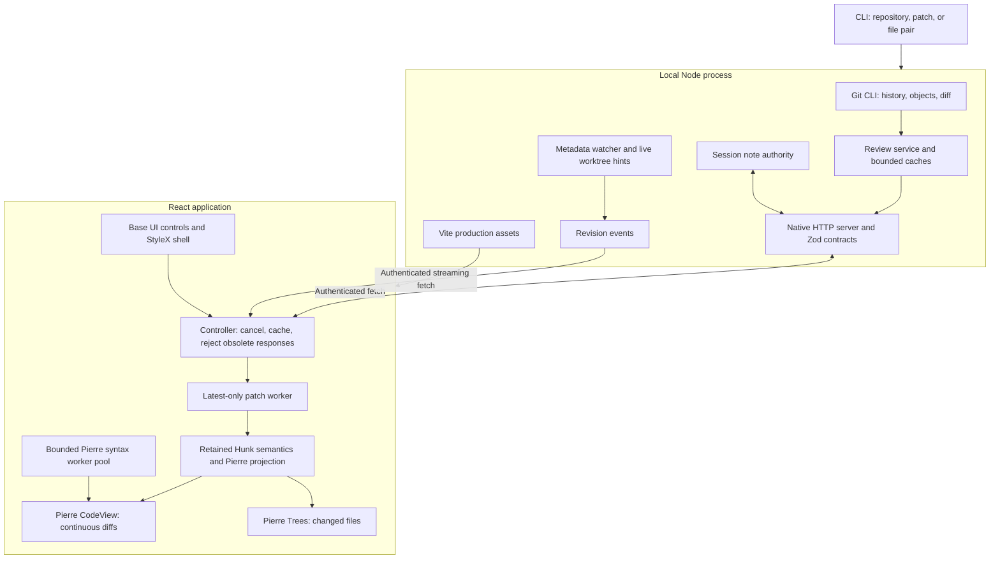

# Med architecture

Med is a local Node host and a compiled React app. The host reads Git, local
files, vaults, and agent transcripts, and serves an authenticated HTTP API. The
browser renders diffs, files, notes, and sessions. Selecting a commit reads Git
objects; it does not change HEAD or check out files.

Related: [file browsing](docs/FILE_BROWSING.md), [agent sessions](docs/SESSIONS.md),
[agent integration](docs/AGENT_INTEGRATION.md), [usage](docs/USAGE.md), and
[testing](docs/TESTING.md).

## Layout

```text
┌ Repository / branch ⌄   Brief · Changes · file tabs              ┐
├───────────────────┬──────────────────────────────────────────────┤
│ Workspaces     +  │ Comparison title        Split / Unified      │
│ ▤ notes           │                                              │
│ ⑂ main        12  │                                              │
├───────────────────┤                                              │
│ Commit graph      │                         Find · Wrap · Notes  │
│ Paged history     │                                              │
├───────────────────┼──────────────────────────────────────────────┤
│ Changed files     │ File A header                                │
│ Path filter       │ Hunks · source selection · context · notes   │
│ Tree and counts   │ File B header                                │
│                   │ Hunks …                                      │
│                   │ File C …                 One scroll surface  │
├───────────────────┴──────────────────────────────────────────────┤
│ Connection · file totals · request / parse / first-frame timing  │
└──────────────────────────────────────────────────────────────────┘
```

All changed paths stay in the tree. Selecting a path shows it in the one
continuous diff stream. Binary files, oversized files, and entries without a
text patch get metadata rows; Med does not invent empty patches. Pierre's
virtualizer mounts only nearby rows.

The graph shows the ancestry of the selected worktree's HEAD or branch, in
topological order, paged from a resolved tip. A merge shows its first-parent
diff, and a root commit compares with the empty tree. A missing parent at a
shallow boundary gives a clear error.

Branch tabs map local refs to the worktrees that Git reports. An attached
branch opens its working changes; a branch without a worktree opens its
committed snapshot, without working-copy controls. A stale worktree mapping
falls back to the snapshot. No tab action runs checkout or switch.

The read-only file browser has a right sidebar and center tabs beside a
permanent Changes tab. Attached worktrees give current files; other branches
give an exact commit tree.

## Boundaries and dependencies



| Responsibility                               | Implementation                                                                         |
| -------------------------------------------- | -------------------------------------------------------------------------------------- |
| Diff rendering, line virtualization, context | `@pierre/diffs` 1.4.3, patched at build time; one CodeView, no second virtualizer      |
| File trees                                   | `@pierre/trees`                                                                        |
| Syntax tokens                                | Twinkleplop and Med's own grammars ([syntax highlighting](#syntax-highlighting))       |
| Editing                                      | CodeMirror 6 and `@replit/codemirror-vim`, loaded on demand                            |
| Selectors, menus, dialogs, tooltips          | `@base-ui/react`                                                                       |
| Layout, themes, focus, density               | StyleX and a small CSS reset                                                           |
| Markdown                                     | unified, remark, and rehype in a worker; KaTeX and Mermaid on demand                   |
| Commit graph, separators, status elements    | Local React, HTML, and SVG                                                             |
| Browser state                                | Local controllers and React external-store subscriptions                               |
| Review semantics                             | Pinned Hunk source ([Hunk provenance](#hunk-provenance))                               |
| Runtime schemas                              | Zod                                                                                    |
| Git and processes                            | Node subprocess API and the installed Git CLI                                          |
| Watch hints                                  | Native recursive watch on macOS and Windows; bounded Chokidar fallback, reconciliation |
| HTTP and SSE                                 | Native Node HTTP and browser fetch                                                     |

Med needs no Hono, Express, query framework, router, generic state store,
splitter library, daemon broker, or desktop framework. The installed app serves
its compiled assets. It never loads the reviewed repository's Vite config or
runs its scripts. [Dependencies](../../docs/DEPENDENCIES.md) says when to build
our own code and when to take a dependency.

Vite 8 supplies Rolldown and Oxc. The React plugin uses Oxc; the StyleX plugin
still uses Babel at build time. Oxlint runs StyleX's validation plugin, and an
integration test confirms that an invalid StyleX declaration fails. Oxfmt
formats; TypeScript and Vitest check. The lockfile pins all versions.

## Syntax highlighting

Twinkleplop gives tokens to the worker and main-thread paths. Med has its own
grammars for Java, C++, XML, JSON, JSONC, Go, Rust, and Swift in
`src/web/highlighting/languages/`. The Go, Rust, and Swift scanners give the
scope stacks of the TextMate grammars that Shiki uses;
[upstream/GRAMMARS.md](upstream/GRAMMARS.md) records their sources and licenses.
`languages.ts` loads each grammar on demand and adds the root scope, such as
`source.json`, to scanners that give scope stacks. `scopeOverrides` maps
Twinkleplop's CSS token kinds to the scopes that Shiki uses. The adapter
(`src/web/highlighting/adapter.ts`) reads each token's scope stack, changes
UTF-16 ranges to Pierre's HAST, and adds word-change decorations and theme
colors. It resolves theme rules as vscode-textmate does, with parent and child
(`>`) selectors and their specificity. Twinkleplop grammars give one scope per
token kind, so parent selectors seldom match them. Markdown fences load their
embedded grammars. Unsupported languages use plain text.
`bun run test:highlighting` compares Med's grammars with Shiki through Pierre.
Go, Rust, and Swift use Shiki's Oniguruma engine as the reference, because its
JavaScript engine misreads some Swift comments and fails on some Go files.

`tools/pierre-highlighter.ts` patches Pierre 1.4.3 at build time and rejects
another version or a missing source boundary. Pierre keeps the worker queue,
cache, diff layout, and line transforms. Full-file workers tokenize the whole
source and send styled text runs with a shared style table. The pool builds a
line's HAST only when the renderer asks for it, and rejects obsolete results
before it decodes them. Diff results keep Pierre's wire format.

The normal build has no Shiki tokenizer or grammar modules. Theme data, theme
normalization, and Pierre's token transform stay as transitive Shiki
dependencies. The build fails when emitted chunks contain a Shiki engine or
grammar module. A Pierre upgrade needs a new integration audit.
`MED_HIGHLIGHTER=shiki bun run build:web` builds the comparison baseline with
Pierre's original engine. See
[the integration and video comparison](docs/validation/HIGHLIGHTER_INTEGRATION.md).

A file read resolves the language during I/O and starts bounded highlighting
when the response arrives, before React mounts the view. The viewer joins that
task through Pierre's cache key.

## Requests, identity, and invalidation

```mermaid
sequenceDiagram
  participant U as User
  participant C as Browser controller
  participant H as Local host
  participant G as Git
  participant W as Patch worker
  participant V as Pierre stream
  U->>C: Select commit
  C->>C: Cancel old fetch and parse; check bounded cache
  C->>H: Review request with comparison
  H->>G: Resolve objects and obtain bounded patch / metadata
  H-->>C: Review ID, resolved endpoints, files, patch, timing
  C->>W: Parse patch
  W-->>C: Parsed file metadata
  C->>C: Reject result if selection changed
  C->>V: Project all files; render visible rows
  V->>H: Request full source for context expansion
  H-->>V: Matching immutable bytes, or stale error
  G-->>H: Worktree or metadata watch hint
  H-->>C: Revision event
  C->>C: Refresh affected mutable view and history
```

The first request sends one bounded patch and all file metadata. A latest-only
worker parses it; a new parse stops obsolete work. Full source reads occur on
demand, for context expansion.

Full object IDs permit immutable caching. Symbolic revisions, patches, file
pairs, and working changes are read again. Fetches and note loads carry request
generations, so a late response cannot replace a newer comparison. Note
changes carry an expected revision, and the server rejects outdated changes.

Notes survive refreshes. Notes on changed files become stale; notes on missing
files become orphaned and stay accessible. Med does not move notes to new line
numbers. Branch review notes live in host memory; saved reviews use a
persistent store.

Immutable context comes from resolved Git objects. Mutable context checks its
captured file and index signature before Med returns it. File pairs use frozen
byte snapshots; standalone patches do not claim full-source authority. A stale
source request fails; it does not mix current contents with an old patch.

Watch events are hints, not content. Commit browsing watches Git metadata only;
working views watch the worktree. Med coalesces events, and periodic status
reconciliation finds missed changes. A reconnect refreshes, also when a
revision repeats. A refresh can replace the whole patch.

Review and source caches have byte and entry limits (`src/shared/byte-lru.ts`).
Pierre gets a separate render copy, because context hydration changes metadata.
Cache limits are not a process memory limit. Host requests, event streams, file
inputs, note text, and note count have limits too.

## Repositories and workspaces

A repository family is identified by its canonical Git common directory.
Linked worktrees share its opaque registry ID; separate clones have separate
IDs. Tab identities combine the repository ID with a branch name or a detached
worktree path. File sources keep their exact repository path and, for
committed content, the object ID.

The host validates registered paths before reads and routes search to the
owning repository. Discovery replaces worktree membership, so a removed path
loses access. Removing a registration revokes its sources and review IDs and
releases its watchers and search service. Registration never changes files or
branches.

A workspace is a task: a branch or detached worktree, a saved review, or a
vault. `data/workspaces.ts` keeps identities and display text in `localStorage`
(`med:workspaces:v1`, at most 24), and windows share the list through `storage`
events. Each window keeps its own active workspace. The first branch workspace
is the home and cannot close. A branch change in a workspace cancels old
requests, restores that branch's navigation, and reloads mutable content.

`WorkspaceHost` (`components/Workspaces.tsx`) owns the store, the address,
`⌘1`–`⌘9`, and the `⌃Tab` switcher. Each workspace has its own review controller
and `App`. The four most recently shown stay mounted in React `<Activity>`;
older ones are disposed and load again when shown. Activity runs effect
cleanups when it hides a workspace, so objects that live as long as the
workspace register with `useDisposeOnClose`. `tools/pierre-keep-alive.ts` and
`StableFileTree` keep Pierre's views and trees while a workspace is hidden.
When the browser is idle, the pool mounts the next workspace in advance.

Only the workspace on screen keeps its live-update stream; `resume()`
reconciles without clearing the screen. This keeps one stream per window in
the browser's limit of six connections per origin. Agents announce new reviews
on `GET /api/windows`. One window holds that stream under a Web Lock and passes
reviews to the other windows on a `BroadcastChannel`.

The address follows the active workspace: `/review/<id>`, `/vault/<id>`, or `/`
with the workspace ID in `history.state`. Back and Forward move between
workspaces.

A theme is a whole look (`Aesthetic` in `themes.ts`): fonts, corners,
hairlines, selection, buttons, label case, and shadows, as `--med-*` variables.
Code stays in Paper Mono. Fonts and icons ship with Med. See
[theme sources](upstream/THEMES.md).

## Git behavior and limits

Med runs the Git CLI with argument arrays and an explicit repository
directory. It disables external diff helpers, textconv, and repository
fsmonitor hooks. It limits subprocess output while it reads, cancels obsolete
processes, and enforces timeouts. It discovers worktrees with Git; it does not
assume that `.git` is a directory.

| Mode      | Before                     | After                                   |
| --------- | -------------------------- | --------------------------------------- |
| Working   | HEAD or empty tree         | Worktree, including untracked additions |
| Staged    | HEAD or empty tree         | Index                                   |
| Unstaged  | Index                      | Worktree, including untracked additions |
| Commit    | First parent or empty tree | Selected commit                         |
| Range     | Resolved base              | Resolved head                           |
| File pair | Explicit old file snapshot | Explicit new file snapshot              |
| Patch     | Patch-provided before side | Patch-provided after side               |

A range compares its two endpoints. `mergeBase: true` first resolves one common
ancestor; no merge base or more than one gives a clear error. Saved reviews
freeze the resolved endpoints. A worktree selection reads another working
directory and index, with shared Git objects; it does not run `git switch`.

**Push.** The Push dialog publishes one exact commit to a named branch of a
configured remote. The host validates refs, keeps push hooks, and disables
force, mirror, tag following, and recursive submodule pushes. It rejects
remotes with more than one push URL and does not show remote diagnostics,
because they can contain credentials. No browsing or comparison action pushes.

**Commit.** The Commit tab (`src/host/repository/commit-flow.ts`) is the only
part of Med that changes the index or makes commits. Stage and unstage take
whole files, and each path is literal (`GIT_LITERAL_PATHSPECS`). A commit sends
its message on standard input with the index key that the view showed: a hash
of HEAD and of each index entry that differs from HEAD. If the index or HEAD
changed, the host returns 409 and commits nothing. Hooks run as in a terminal,
without an editor or a credential prompt; when a hook stops the commit, the 422
response has the last 8,000 characters of its output. Push from the Commit tab
uses the same exact-commit push, to the branch's upstream; a branch without an
upstream pushes only after the user agrees. There is no force push, amend, hunk
staging, or branch switch.

## Saved reviews and agent sessions

The CLI uses a stable default port (4173) and a private state directory
(`~/.local/state/med`). A persistent credential and a connection record for
each port let `review repos` and `review create` find the running host. The
browser exchanges the launch token for a same-origin HttpOnly cookie, then
removes the token from the URL. Saved links contain only a review ID and cannot
register repositories.

`src/shared/saved-review.ts` defines a review bundle with one or more
repository and comparison targets. Before it writes a bundle, the host resolves
commit references and captures the patch and the supported source bytes.
Comments are kept for each target; feedback export and clear apply to the whole
bundle. Revision checks stop a stale clear from deleting newer comments. Atomic
private files and a cross-process write lock protect the records. Saved source
does not follow watcher events.

A bundle can hold a Markdown brief and pinned notes. `src/web/data/brief.ts`
resolves each link to a changed file and line range (exact path, then a unique
path suffix) and shows the cited range as an excerpt. A bundle with a pull
request URL can show GitHub comments: `GET /api/reviews/:id/pull-request` runs
`gh api` with GET requests only and keeps the result for 30 seconds. Med never
writes to GitHub.

A bundle records the agent sessions that worked on it. The host converts a
session's Claude Code transcript or Codex rollout to Agent Client Protocol
`session/update` shapes and streams them (`src/host/agent-transcripts.ts`); see
[agent sessions](docs/SESSIONS.md). The CLI contract and data limits are in
[agent integration](docs/AGENT_INTEGRATION.md).

## Editing and file writes

Eligible worktree and local files open in CodeMirror in Vim Normal mode.
Commit snapshots, dropped files, and files above the edit limit use Pierre.
Opening a file never writes it. Drafts and undo history live in a bounded
store for each `App`, in memory only; a reload loses them, and closing a dirty
editor needs an explicit discard. A disposable worker gives syntax
decorations; a generation number stops an older result from coloring newer
text.

`POST /api/browse/write` uses the host, origin, session, and repository checks.
It accepts a worktree source, a relative path, the expected content identity,
and up to 1 MiB of UTF-8 text. Saves to one file run one at a time. The host
validates the path and content, writes and flushes a sibling temporary file,
checks the current content, file metadata, and repository access again, then
atomically replaces the target. A detected change returns 409 and keeps the
draft. Another process can still write after the last check. There is no
forced overwrite or automatic merge. Hard-linked and symlinked files are
refused. A save does not stage or commit.

Standalone files have their own source kind. Each grant is one exact canonical
path, at most 256 for each host, and Med does not register or index the parent
folder. Dropped files stay in the browser and never reach the host.

Full-file gutter markers carry a content identity. The host uses captured
sources only when the displayed bytes match; otherwise a working file compares
with HEAD. Git makes zero-context hunks in a disposable directory and changes
no checkout file. Blame reads 1,000-line chunks, keeps 32, and shares one
`git blame` process for each chunk.

## Markdown preview

The preview worker runs remark-parse, remark-gfm, remark-math, remark-rehype,
and rehype-stringify. It keeps top-level source ranges for scroll mapping and
heading IDs for navigation. **Raw HTML is disabled and link schemes are
limited.** KaTeX loads only for math, with trust disabled and expansion
limits. Mermaid loads on demand, renders near the viewport, and uses strict
security. Code fences use the Twinkleplop adapter.

Image requests accept only supported image types up to 8 MiB, with exact
document grants or registered repository access. Standalone images stay in the
document folder, repository images in the repository, and commit images come
from the same Git tree. Symlinked paths and traversal are refused. Image
responses have a restrictive CSP and no-sniff and no-store headers.

Relative links resolve from the document path, not the browser route, and
cannot leave their source root. Vault links stay in the vault. No Obsidian
plugins run.

## Media

File reads classify media by extension after the source and path checks.
Responses contain the MIME type, size, and version, never encoded media.
`/api/media` serves authenticated GET and HEAD requests with single byte
ranges. Worktree and local sources open no-follow handles and seek; commit
sources stream `git cat-file` with backpressure. Streams use 64 KiB chunks,
stop on disconnect, and check repository access for each chunk. Images are
limited to 32 MiB and videos to 4 GiB. Rendered SVGs never enter the DOM as
markup. Saved reviews store bounded image snapshots.

## Service and vaults

`ServiceManager` owns `SourceCatalogue`, registered repositories, vault
watchers, and the vault index queue. A private exclusive lock stops two managed
servers from owning one state directory. `med web` starts a detached server
only when needed; `med serve` runs the same owner in the foreground. Login
service installation is a separate, explicit operation.

`GET /api/build` reports whether the code on disk differs from the running
code. `POST /api/service/restart` first runs `--version` from disk, so a broken
build never replaces a working server; under its LaunchAgent, the server asks
launchd to restart it.

A vault is identified by its canonical folder. Watch events wait 150 ms, with
reconciliation every 60 seconds. One short-lived subprocess parses and writes
SQLite (`bun:sqlite` or `node:sqlite`); no indexing runs in HTTP handlers.
Read-only WAL connections serve backlinks during an update, and the last good
index stays readable. Enumeration skips hidden and dependency folders and
symlinks; reads do not follow links. Private content never enters Git.

First-run discovery (`setup`, `discover`, `login`) searches the home folder to
depth 4, at most 40,000 folders and six seconds. It reads folder names and Git
metadata only and does not follow links. `login` writes or removes the
LaunchAgent plist only.

The standalone build embeds the browser assets and offline guides in one
Bun-compiled executable. Git, Ctags, and Zoekt stay external.

## Hunk provenance

The review semantics come from Hunk
[`9b95a71b76c472bad21ffa5cc6b01b204e2f6f7a`](https://github.com/modem-dev/hunk/tree/9b95a71b76c472bad21ffa5cc6b01b204e2f6f7a).
[Provenance](upstream/HUNK.md) records the retained modules and changes, and
the MIT notice stays. Med keeps review actions, anchors, document projection,
geometry, identities, navigation, note limits, reducers, selectors, state,
validation, and their behavior tests. Local adapters connect them to Pierre and
the HTTP controller.

Med does not keep Hunk's daemon transport or publication protocol, and does not
claim compatibility with Hunk agents, extensions, or producer protocols. The
host owns source snapshots and notes; selection, filters, scroll, and
presentation stay in the browser. JJ, Sapling, terminal modes, extensions,
merge editing, and branch changes other than the Commit tab are out of scope.

## Review order

1. `src/shared/protocol.ts`: the wire contract and comparison variants.
2. `src/host/repository/` and `src/host/server.ts`: Git semantics, source
   lifetime, authentication, and limits.
3. `src/web/data/`: response guards, cache policy, projection, and note sync.
4. `src/web/App.tsx`, `components/`, and `theme.stylex.ts`: layout and controls.
5. `tests/` and `scripts/`: behavior and reproducible measurements.

Measurements: [file browsing](docs/validation/FILE_BROWSING.md),
[interactions](docs/validation/INTERACTIONS.md),
[file opening](docs/validation/FILE_OPENING_SECOND_PASS.md),
[highlighting](docs/validation/HIGHLIGHTER_INTEGRATION.md),
[vault index](docs/validation/VAULT_INDEX.md), and
[media](docs/validation/MEDIA.md).
