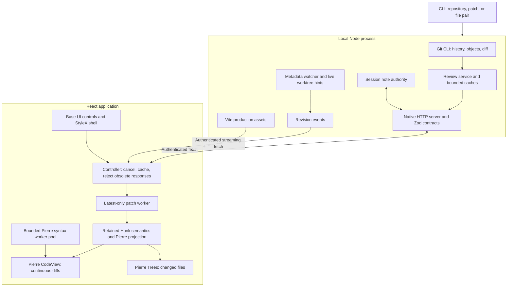

# Continuous diff review: implemented architecture

Status: integrated implementation, 19 September 2026. The user approved implementation after the source audit and added commit-history navigation, live themes, and branch/worktree tabs. See [baseline performance](docs/validation/RESULTS.md) and [UI validation](docs/validation/UI_UPDATE.md) for measurements and limits.

Read-only full-file browsing now uses a right file sidebar and center file tabs beside a permanent Changes tab. Its source is independent of the selected diff: attached worktrees always provide current files, while unattached branches provide an exact commit tree. Authenticated, bounded list/read endpoints share the existing host and watcher. See [file browsing](docs/FILE_BROWSING.md) for contracts, data flow, limits, and remaining scope, and [browsing validation](docs/validation/FILE_BROWSING.md) for measured results.

## Product and layout

The `apps/med` workspace starts a local Node host and serves a compiled React application. A compact shell uses StyleX, Base UI, and Pierre Diffs/Trees. Selecting a commit reads its Git objects. It does not change HEAD or check out files.

```text
┌ Repository / branch ⌄   Brief · Changes · file tabs              ┐
├───────────────────┬──────────────────────────────────────────────┤
│ Workspaces     +  │ Comparison title        Split / Unified      │
│ ▤ notes           │                                              │
│ ⑂ main        12  │                                              │
├───────────────────┤                                              │
│ Commit graph      │                         Find · Wrap · Notes  │
│ Paged history     │                                              │
├───────────────────┼──────────────────────────────────────────────┤
│ Changed files     │ File A header                                │
│ Path filter       │ Hunks · source selection · context · notes   │
│ Tree and counts   │ File B header                                │
│                   │ Hunks …                                      │
│                   │ File C …                 One scroll surface  │
├───────────────────┴──────────────────────────────────────────────┤
│ Connection · file totals · request / parse / first-frame timing  │
└──────────────────────────────────────────────────────────────────┘
```

All changed paths stay in the tree. Selecting a path reveals it in the continuous diff stream. Binary files, oversized files, and entries without a text patch have explicit metadata rows. The renderer does not invent empty text patches for them. Only nearby code rows are mounted by Pierre's virtualizer.

The graph shows the selected worktree's HEAD ancestry, or the selected branch's ancestry, in topological order with parent edges and paged loading. It is not yet an all-branches repository graph. Pagination stays pinned to a resolved tip. Selecting a merge shows its first-parent diff. A root commit compares with the empty tree. A shallow boundary with a missing parent produces a clear error.

Branch tabs map local refs to worktrees discovered by Git. An attached branch opens its working changes. A branch without a worktree opens its committed snapshot and hides working-copy controls. A stale worktree mapping falls back to the branch snapshot. Detached worktrees remain selectable. No tab action runs checkout or switch.

### Multiple repositories

One host can register several local repositories. Open branch groups their branches and worktrees in one picker; workspaces can span repositories. The sidebar's branch switcher shows the current workspace's repository and branch. There is no separate repository navigation screen. The workspace on screen controls history, reviews, files, search, and symbols.

A repository family is identified by the canonical Git common directory. Linked worktrees share its opaque registry ID; separate clones have separate IDs. The Git command directory remains a checkout path. Browser tab identities combine the repository ID with a branch name or detached worktree path. File sources retain their exact repository path and, for committed content, object ID.

The host validates registered paths before reads and routes search to the owning repository's service. Discovery replaces worktree membership so removed paths do not remain authorized. Removing a registration revokes its sources and review IDs and releases its watchers and search service. Registration and removal never change reviewed files or Git branches.

Within one workspace, a branch change replaces the review: it cancels old requests, restores that branch's navigation record, and reloads mutable content; request generations reject late responses. File navigation is retained for up to 32 branches, with up to 12 file tabs each, while only the active file retains loaded bytes in the workspace store.

### Workspaces

A workspace is a task: a branch or detached worktree, a saved review, or a registered vault. `data/workspaces.ts` keeps the list, the active workspace, and the recent order in `localStorage` (`med:workspaces:v1`, at most 24). It persists only identities and display text, such as the title and changed-file count. A branch workspace records its repository ID, worktree path, and branch once it loads, so a reload opens it directly. The first branch workspace is the home: it cannot close, and a workspace that comes to show the same branch takes its place. Windows share the list through `storage` events; each window adopts the other's list without writing back, and keeps its own active workspace. Reviews and vaults have the same ID in every window, so windows that add one at the same time agree.

`WorkspaceHost` (`components/Workspaces.tsx`) sits above the vault and file surfaces. It owns the store, the address, `⌘1`–`⌘9`, and the `⌃Tab` switcher. `WorkspaceViews` gives each workspace its own review controller and `App`. The four most recently shown stay mounted inside React `<Activity>`; a hidden one keeps its state and DOM, and its effects, listeners, and dialogs stop. Older workspaces are disposed and load again when shown. Activity runs effect cleanups when it hides a workspace, so objects that live as long as the workspace, such as file tabs, register with `useDisposeOnClose` and are disposed only when the pool drops the workspace. The host also restores scroll offsets, because hidden elements lose them, and repeats the restore after Pierre's virtualizer measures again.

Only the workspace on screen keeps its live-update stream. `suspend()` closes the stream; `resume()` reopens it and reconciles history, branches, and a mutable comparison, as a reconnect does. This keeps one stream per window within the browser's six connections per origin.

Agents announce new reviews on the window channel. `review create` posts to `/api/windows/review`, and the host sends a `review` event on each `GET /api/windows` stream and returns how many it reached. With `--open` and no stream, the CLI opens the review link. In the browser, one window holds the channel under a Web Lock and passes each review to the other windows on a `BroadcastChannel`, so the browser keeps one channel stream, not one per window. Each window adds the review unread. With `open`, the window used last shows it: windows record themselves in `localStorage` (`med:window`) on focus or a pointer press, and clear the record when they close.

The address follows the active workspace. A saved review keeps `/review/<id>`; a vault keeps `/vault/<id>` and its open file; branch workspaces share `/` and carry their ID in `history.state`. A switch pushes a history entry and dispatches `popstate`, so the vault and standalone-file surfaces follow it, and Back and Forward move between workspaces. The vault surface keeps the reviews mounted beneath it. Registered vaults come from the service status and are pinned first. Global DOM checks, such as for an open dialog or the main file pane, consider only visible elements, because hidden workspaces keep theirs in the document.

Base UI supplies tabs and the searchable theme dialog. Theme selection previews the whole application; Enter saves locally, and dismissal restores the saved theme. Semantic CSS variables connect StyleX, Pierre Trees, and the diff theme. Geist fonts and Med's own 16-pixel icon set (with the GitHub mark for pull-request links) ship locally. No runtime dependency was added for these controls. See [theme sources](upstream/THEMES.md).

## Boundaries and dependencies



| Responsibility                                       | Implementation                                                                         |
| ---------------------------------------------------- | -------------------------------------------------------------------------------------- |
| Diff rendering, line virtualization, syntax, context | `@pierre/diffs` 1.4.3; one CodeView, no second virtualizer                             |
| Changed-file tree                                    | `@pierre/trees` 1.0.0-beta.6                                                           |
| Selectors, menus, command and note dialogs, tooltips | `@base-ui/react` 1.8.0                                                                 |
| Layout, themes, focus and density                    | StyleX 0.19.1 and a small CSS reset                                                    |
| Commit graph, separators, simple status elements     | Local React/HTML/SVG code                                                              |
| Browser state and subscription                       | Local controller and React external-store subscription                                 |
| Review semantics                                     | Pinned Hunk source, adapted at module boundaries                                       |
| Runtime schemas                                      | Zod 4.6.5, latest stable at installation                                               |
| Git and process lifecycle                            | Node subprocess API; installed Git CLI                                                 |
| Watch hints                                          | Native recursive watch on macOS/Windows; bounded Chokidar fallback plus reconciliation |
| HTTP and SSE                                         | Native Node HTTP and browser fetch                                                     |

No Hono, Express, query framework, router, generic state store, splitter library, daemon broker, or desktop framework is required. The installed app serves its compiled assets. It never loads the reviewed repository's Vite config or runs its scripts.

Vite 8 supplies Rolldown and Oxc. The official React plugin uses Oxc; the official StyleX plugin still uses Babel internally at build time. Oxlint runs StyleX's validation plugin directly. An integration test confirms that an invalid StyleX declaration fails. Oxfmt formats local code. TypeScript and Vitest provide static and runtime checks. The lockfile pins all versions.

## Hunk reuse and changed scope

The source baseline is Hunk [`9b95a71b76c472bad21ffa5cc6b01b204e2f6f7a`](https://github.com/modem-dev/hunk/tree/9b95a71b76c472bad21ffa5cc6b01b204e2f6f7a). [Provenance](upstream/HUNK.md) records retained modules and adaptations. The original MIT notice is retained.

The port retains review actions, anchors, document projection, geometry, identities, navigation, note limits, reducers, selectors, state/store, validation, and their behavior tests. Local adapters connect these rules to Pierre and the HTTP controller. This is a source port of review semantics, not a port of every Hunk runtime service.

The original proposal considered retaining Hunk's daemon transport and publication protocol. The implemented host uses a smaller direct HTTP contract instead. It does not claim compatibility with Hunk agents, extensions, producer protocols, or publication deltas. The host owns source snapshots and notes. Selection, filtering, scroll, and presentation remain browser-local. There is no shared cursor or cross-client note push.

JJ/Sapling, rich STML, terminal modes, extension execution, local branch mutation, merge editing, Zed theme import, and native desktop installation remain outside this version.

## Requests, identity, and invalidation

```mermaid
sequenceDiagram
  participant U as User
  participant C as Browser controller
  participant H as Local host
  participant G as Git
  participant W as Patch worker
  participant V as Pierre stream
  U->>C: Select commit
  C->>C: Cancel old fetch and parse; check bounded cache
  C->>H: Review request with comparison
  H->>G: Resolve objects and obtain bounded patch / metadata
  H-->>C: Review ID, resolved endpoints, files, patch, timing
  C->>W: Parse patch
  W-->>C: Parsed file metadata
  C->>C: Reject result if selection changed
  C->>V: Project all files; render visible rows
  V->>H: Request full source for context expansion
  H-->>V: Matching immutable bytes, or stale error
  G-->>H: Worktree or metadata watch hint
  H-->>C: Revision event
  C->>C: Refresh affected mutable view and history
```

The first request transfers one bounded patch and all file metadata. Initial patch transfer is not paged per file. Parsing runs in a latest-only worker. A new parse terminates obsolete work. Full source reads occur on demand for context expansion. Syntax work uses Pierre's bounded pool.

Twinkleplop supplies tokens for both the worker and main-thread rendering paths. `tools/pierre-highlighter.ts` applies a version-checked integration patch to Pierre 1.4.3 at build time. Pierre retains the worker queue, cache, diff layout, and line transforms. Full-file workers tokenize the complete source, then send JSON containing styled text runs and a shared style table. The pool exposes Pierre's normal line array, but constructs and caches each line's HAST only when the renderer requests it. This avoids constructing and transferring offscreen render nodes. Obsolete results are rejected before decoding. Main-thread fallback rendering still builds normal HAST on demand. Diff results retain the upstream wire format. The adapter in `src/web/highlighting` converts UTF-16 token ranges to Pierre's HAST format, including word-change decorations and theme colours. Markdown fences load their embedded grammars. Unsupported languages use plain text.

File reads resolve language descriptors while I/O is pending and start bounded highlighting when the response arrives, before React mounts the view. The visible viewer joins the same task through Pierre's cache key. It flushes its render when that task completes; unmounted or replaced views ignore completion. Normal reads still check the host for fresh content. Workers load syntax grammars; the main thread loads them only for fallback rendering. See [file-opening measurements](docs/validation/FILE_OPENING_SECOND_PASS.md).

The normal build has no Shiki tokenizer or grammar modules. Theme data, theme normalization, and Pierre's token transform utility remain transitive Shiki dependencies. The patch rejects a different Pierre version or a missing source boundary; builds also reject Shiki engine/grammar modules in emitted chunks. Upgrading Pierre requires a new integration audit. `MED_HIGHLIGHTER=shiki bun run build:web` produces the comparison baseline, with the original Pierre engine. Engines cannot switch within a running build, so cached render results cannot cross engines. See [the integration and video comparison](docs/validation/HIGHLIGHTER_INTEGRATION.md).

Full object IDs permit immutable review caching. Symbolic revisions, patches, file pairs, and working changes are re-read. Browser fetches and note loads carry request-generation checks so late responses cannot replace a newer comparison. Note mutations carry an expected revision. The server rejects outdated mutations.

Live note scopes survive review refreshes. Notes on changed files become stale; notes on missing files become orphaned and remain accessible. This version does not infer new line coordinates. Normal branch review notes live in host memory and end when that process closes. Saved agent reviews use a separate persistent store.

Immutable context comes from resolved Git objects. Mutable context validates its captured file/index signature before it is returned. File-pair inputs use frozen byte snapshots. Standalone patches do not claim full-source authority. Patch/file inputs use manual refresh. A stale source request fails instead of mixing current contents with an old patch.

Watch events are hints, not file content. Commit browsing watches Git metadata without opening a watcher for every source file. Working/unstaged views enable live worktree observation. Events are coalesced, and periodic status reconciliation recovers missed changes. Reconnect causes a refresh even when an event revision repeats. A refresh can still replace an entire patch; this version does not promise per-file incremental parsing or stable positions for every live edit.

## Git behavior and resource bounds

Use Git CLI argument arrays with an explicit repository directory. Disable external diff helpers, textconv, and repository fsmonitor hooks. Limit subprocess output while reading; cancel obsolete processes and enforce timeouts. Discover worktrees with Git rather than assuming `.git` is a directory.

| Mode      | Before                     | After                                   |
| --------- | -------------------------- | --------------------------------------- |
| Working   | HEAD or empty tree         | Worktree, including untracked additions |
| Staged    | HEAD or empty tree         | Index                                   |
| Unstaged  | Index                      | Worktree, including untracked additions |
| Commit    | First parent or empty tree | Selected commit                         |
| Range     | Resolved base              | Resolved head                           |
| File pair | Explicit old file snapshot | Explicit new file snapshot              |
| Patch     | Patch-provided before side | Patch-provided after side               |

Range means a direct endpoint comparison by default. `mergeBase: true` resolves one common ancestor before diffing; missing or multiple merge bases produce a clear error. Saved reviews freeze the resolved endpoints. The comparison dropdown uses this mode for feature and stacked branches. Worktree selection reads a different working directory and index, with shared Git objects. It does not execute `git switch`. Git CLI is the first backend; libgit2 would require a measured advantage plus matching behavior and packaging tests.

An explicit Push dialog publishes one exact commit to a named branch of a configured remote. The host validates refs, preserves push hooks, and disables force, mirror, tag following, and recursive submodule pushes. It rejects remotes with multiple push URLs and does not expose remote diagnostics that can contain credentials. No browsing or comparison action pushes.

Review and source caches have byte and entry bounds. Browser canonical parsed reviews and sources have separate budgets. Pierre receives a separate render copy because context hydration mutates metadata. These cache limits are not a total-process memory cap; active hydrated render models need separate profiling. Host requests, event streams, file inputs, note text, and total notes also have bounds. Large or non-text files keep explicit metadata. Output limits, source limits, parsing, syntax work, and DOM virtualization are separate controls.

The Bun test exposed a real watcher cost: opening watchers across the checkout exhausted file descriptors. The host now keeps immutable commit browsing on metadata watchers and uses native recursive observation for live files where supported. The validation report separates first host request, warm cache, browser parse, and first rendered-frame timing. It does not infer sustained frame rate or cold-disk performance from HTTP latency.

## File review order

1. `src/shared/protocol.ts`: shared wire contract and comparison variants.
2. `src/host/repository/` and `src/host/server.ts`: Git semantics, source lifetime, authentication, and limits.
3. `src/web/data/`: response guards, cache policy, projection, and note synchronization.
4. `src/web/App.tsx`, `components/`, and `theme.stylex.ts`: layout and controls.
5. `tests/`, `scripts/`, and `docs/validation/`: behavior, package checks, and reproducible measurements.

[Parallel integration record](docs/IMPLEMENTATION_PLAN.md) and [original audits](docs/audit/) explain the source decisions. Audit files describe their pinned inspection baseline; this file describes the implemented system.

## Saved agent reviews

The CLI uses a stable default port (4173) and private state directory (`~/.local/state/med`). A persistent credential and per-port connection record let `review repos` and `review create` find the running host. The browser exchanges the launch token for a same-origin HttpOnly cookie, then removes the token from the URL. Saved links contain only a review ID. They cannot register repositories.

`src/shared/saved-review.ts` defines a review bundle with one or more repository/comparison targets. The host resolves commit references and captures the patch and supported source bytes before it writes a bundle. Mutable working comparisons are labelled as captured changes. The store keeps comments separate for each target, while feedback export and clear operate on the whole bundle. Revision checks prevent a stale clear from deleting newer comments. Atomic private files and a cross-process write lock protect persistent records.

The browser opens one target at a time. Saved source does not follow watcher events. The normal file browser and commit history remain available; the header shows when the user has left the saved comparison. Feedback export uses captured source, including selected lines and adjacent context. Saved file access requires the repository family to remain registered, but a surviving checkout can replace a removed linked worktree as the session anchor.

A bundle can hold one Markdown brief. `POST /api/reviews/:id/brief` replaces or removes it without a new comment revision, so comment writes and a brief change do not conflict. The browser renders the brief in the Markdown worker with link marking on. `src/web/data/brief.ts` then resolves each link to a changed file and line range: exact path first, then a unique path suffix, so agents in another working directory still resolve. Each cited range becomes an excerpt: a subset of the captured patch, parsed again for Pierre's `FileDiff`, or captured source lines when the range has no changes. Excerpts mount near the viewport only. `BriefView` loads lazily and stays mounted after first use, to keep its scroll position. A paste on live changes saves the comparison first, because a brief is only stable against captured code.

See [agent integration](docs/AGENT_INTEGRATION.md) for the CLI contract, repository selection policy, data limits, and user-confirmed `AGENTS.md` guidance.

## Working-file editing

The read-only file/diff viewer stays on Pierre. Editing lazy-loads CodeMirror 6
and `@replit/codemirror-vim`. Its document state and undo history live in a bounded
per-App draft store keyed by source and file path. Changes update the store without
rerendering React for every keystroke; saved/dirty transitions notify subscribers.
Vim Insert typing is grouped into one undo event, including the deletion in a
change command. Commit sources cannot enter this editor.
Normal and Visual cursor moves use the same 65 ms ease-out as the file viewer.
The cursor layer scrolls with the document; reduced-motion preferences disable
the transition. Insert mode retains the standard caret.

A separate, disposable worker supplies Twinkleplop text-range decorations. Input
updates immediately; syntax runs after a 100 ms pause. Results carry a generation
number so an older response cannot color newer text. Full-file syntax scanning
stays off the main thread and the editor renders only its visible document area.
Themes use the existing palette. Shiki grammar code is not added to editing.

`POST /api/browse/write` uses the existing host/origin/session and repository
checks. It accepts a worktree source, relative path, expected content identity,
and up to 1 MiB of UTF-8 text. Med saves serialize per file. The host validates the
path and content, writes and flushes a sibling temporary file, checks current
content and file metadata again, then atomically replaces the target. It checks
repository authorization again before replacement. Detected changes return 409
and preserve the draft. This is not a filesystem transaction against arbitrary
external writers: another process can still write after the final check or save.
There is no forced overwrite, automatic merge, staging, or commit.

Browser unload warns when drafts are dirty or saving. Drafts are memory-only;
closing a tab retains them, but browser reload does not. Closing the editing
surface with dirty text requires explicit discard. Atomic replacement preserves
ordinary file mode bits; hard-linked and symlinked files are refused. Extended
attributes and ACL copying are not implemented.

## Standalone files and full-file markers

`LocalFiles` is a file workspace around the existing viewer and editor. Explicit
local paths and browser-only dropped bytes have separate source kinds; Git
browse requests continue to accept only worktree and commit sources. Standalone
file grants are exact canonical paths, capped at 256 per host. The local adapter
reuses bounded UTF-8 reads and atomic conflict-checked writes, without registering
or indexing parent folders. The browser bounds tab count and retained bytes.
Drops are read-only and never reach the host. `/file/<absolute-path>` and the
`open` CLI command support current file links; `/file?repo=…&path=…` remains valid.

Full-file gutter requests carry a content identity and optional runtime/saved
comparison. The host verifies identity, then uses captured before/after sources
only when the displayed bytes match. Otherwise a working file compares with
HEAD. Git generates bounded zero-context hunks in a disposable directory; no
checkout files are changed. Requests are cancellable and temporary files are
removed. The browser indexes hunk spans once and paints only mounted Pierre
number cells. Stale file views drop their markers until refresh.

## Live Markdown preview

`FullFileView` keeps the Preview preference in browser storage and lazy-loads
`MarkdownPreview`. The source remains mounted when Preview changes. A small
imperative bridge sends source-line positions independently of React rendering
and Markdown parsing. Editor document changes update the bridge; a 100 ms debounce
coalesces worker requests. A generation number rejects obsolete results.

The worker uses remark-parse, remark-gfm and remark-math, then remark-rehype and
rehype-stringify. It preserves top-level source ranges for scroll mapping and
heading IDs for navigation. Raw HTML is disabled and link schemes are limited.
KaTeX loads only for math, with trust disabled and expansion limits. Code fences
use the existing Twinkleplop adapter; a bounded cache reuses colored code.
React retains unchanged HTML blocks. Mermaid loads on demand, renders only near
the viewport, and serializes its shared configuration with strict security.
A bounded cache retains diagram SVGs. Closing Preview terminates its worker.

Authenticated image requests accept only supported image types, bounded to 8 MiB,
and use exact opened-document grants or registered repository access. Standalone
images are confined to the document folder; repository images to the repository.
Commit images come from the same Git object tree. Paths through symlinks and
traversal outside the root are rejected. Image responses have restrictive CSP,
no-sniff and no-store headers. Dropped source never requests local disk images.

`node scripts/validate-markdown.mjs` exercises the built host and real browser,
including rendering, Vim draft/undo, source following, persistence, image access,
and malformed content. It records worker timing separately from whole-file-open
latency; these boundaries are not interchangeable.

Preview scroll mapping retains fractional source-line coordinates and interpolates
between block-start anchors, including blank lines and paragraph margins.
`markdown/scroll.ts` owns one frame-rate-independent animation whose target can
change without restarting. Geometry is cached until preview content or size
changes. Manual preview input cancels following until the next source movement;
reduced-motion mode skips animation. Contents navigation uses preview-local scroll
offsets, never `scrollIntoView`, which can scroll overflow-hidden split ancestors.

### Default editable file surface

Eligible local and working-tree files now enter the CodeMirror surface in Vim
Normal mode automatically. Read-only snapshots, drops and files above the edit
limit still use Pierre. Opening a file never writes it. Save remains explicit;
Close and `:q` retain the unsaved-draft confirmation, while `:wq` saves then closes.

The CodeMirror attribution gutter reuses the bounded change/blame painters and
Base UI blame tooltips with light-DOM cells. Unsaved edits suppress attribution
from the prior disk snapshot without collapsing the gutter. Saved responses update
the file workspace identity; watcher invalidation compares the current disk identity
without replacing editor content, so own saves and unrelated edits do not make it stale. Symbol previews and command navigation use the
active editor. Contents jumps add a single cancellable 650 ms line fade after
the destination is mounted; reduced motion omits the animation.

## Persistent service and vaults

`ServiceManager` owns `SourceCatalogue`, registered repositories, native vault
watchers, and the vault indexing queue. CLI commands use the existing authenticated
loopback host. A private exclusive lock prevents multiple managed servers from
owning one state directory. `med web` starts a detached server only when needed;
`med serve` runs the same owner in the foreground. Login-service installation is
an explicit, separate operation. UI repository registration uses the same owner.

`GET /api/build` reports whether the code file on disk differs from the code the
server started with (the CLI script's hash, or a compiled executable's identity),
and the entry script of the page build on disk. The page compares that entry with
its own to offer Reload. `POST /api/service/restart` first runs `--version` from
disk, so a broken build never replaces a working server. Then the server closes,
releases its lock, and starts a detached replacement; under its LaunchAgent it
asks launchd to restart it instead.

Repository identity uses its Git common directory; vault identity uses its
canonical folder. Directory identity is checked before access. Watch events are
debounced for 150 ms, with 60-second reconciliation. One short-lived subprocess
runs the synchronous parser and SQLite writes. No indexing runs in HTTP handlers.
Bun uses `bun:sqlite`; Node uses built-in `node:sqlite`. Read-only WAL connections
serve bounded backlinks while an index update runs. The last successful index
remains readable; status reports failures rather than deleting it.

The index stores fingerprints and outgoing link occurrences. Enumeration skips
hidden/dependency folders and symlinks. Changed notes use bounded, no-follow reads.
Code, math, frontmatter and raw HTML are excluded. A topology change re-resolves
links; ordinary edits update only changed edges. Private content never enters Git.
See [index measurements](docs/validation/VAULT_INDEX.md).

`VaultWorkspace` uses the shared `RepositoryFiles` tree, `FileViewTabs`,
`CommandDialog`, and `FilePicker`, with a right sidebar and collapsible backlinks.
The picker accepts a scoped local-file preview reader without treating a vault
as a Git worktree. Tabs have the same preview/pin/close controls as repository
files; editing pins previews, and close actions protect dirty drafts. Unchanged
manifests retain folder expansion and scroll position across index updates.
It uses the existing file access grants, conflict-checked writes, Vim editor and
Markdown preview. Wiki links are transformed in the preview worker, excluding
code and math; host resolution constrains local links and images to the selected
vault. No Obsidian plugins execute. Browser polling refreshes index revisions;
unsaved drafts remain in the existing editor draft store.

The standalone build imports browser assets as Bun file assets, embeds offline
guides, and compiles one executable. A compiled process respawns itself for
`serve` and the index worker. Node builds preserve the script entrypoint. Git and
optional Ctags/Zoekt tools remain external. Legacy explicit-path foreground hosts
remain supported; they do not share a managed owner's profile or port.

Relative Markdown file links are tagged by the render worker and handled by the
preview's file-opening callback. Resolution uses the document path, not the
browser route, and repository paths cannot escape their source root. The review
workspace supplies the displayed file's `BrowseSource`, preserving commit IDs;
standalone files use their existing local open path. Vault resolution remains
scoped to its catalogue. Dropped previews do not receive a file-opening callback.

The Markdown preview shortcut is captured at window level. The visible main
file's preview button owns the action, so focus in tabs, sidebars or palettes
does not block it. Hidden retained workspaces and compact picker previews do
not respond. Repeated keydown events do not toggle the view again.

App shortcut handlers run in capture phase before CodeMirror Vim. Content search
reads the active file selection through a reader callback (including Pierre's
virtual Visual selection). CodeMirror selections paint below text, so the active
line background must remain translucent. Default yanks mirror Vim register 0 to
the clipboard in the input task; named registers are left unchanged.

### First-run setup

`main.tsx` asks a managed server for its setup status before the first render on
`/` or `/sources`. With nothing registered, the address becomes `/welcome` and
`Root` shows the welcome in place of the app; leaving it starts the app. A browser
that finds sources records `med:welcomed` and skips the check later. A foreground
server has no setup actions, so the check fails quietly.

The welcome (`components/welcome/`) loads lazily and is one page: the found
sources, the login switch, and one action. `field.ts` draws the backdrop with
one WebGL 2 fragment shader: code lines on a plane that recedes from the viewer,
with changed lines in the accent as in Med's icon. Each added source sends a
wave across the lines. The shader takes the theme's colors, pauses while the
tab is hidden, and draws one still frame for reduced motion. Without WebGL 2,
the page keeps its CSS background.

The service adds three actions. `setup` returns the registered sources and the
login item; the page reads it again when the window gets focus. `discover`
searches the home folder breadth first to depth 4, at most 40,000 folders and
six seconds. It reads folder names and Git metadata only, skips hidden,
dependency, and build folders, does not follow links, and leaves out linked
worktrees and submodules. Desktop, Documents, and Downloads need `deep`,
because macOS asks permission for them. Obsidian's own vault list adds vaults
outside the search. `login` writes or removes the LaunchAgent plist only; launchd
loads it at the next login, so the running server is not replaced.
`med service install` still bootstraps the agent at once. `MED_HOME_DIR` points
the search and the login item at a fixture home in tests.

## Media viewing

File reads classify supported media from its extension after source/path checks.
Responses contain MIME type, size, and version identity, never encoded media.
Media bypasses text decoding, syntax workers, and editor state. `/api/media`
serves authenticated GET/HEAD requests with single byte ranges. Worktree and
local sources open no-follow handles and seek directly; commit sources stream
`git cat-file` with backpressure and discard any prefix before the requested
range. Git seeking can therefore cost more CPU and I/O than local seeking.
Streams use 64 KiB file chunks, stop on disconnect, and recheck repository
access for every chunk. No transcode or temporary whole-video copy is needed.

The file viewer uses browser image/video elements and native video controls.
Drops use object URLs without uploads; close and unmount revoke those URLs.
Media references do not count toward the retained UTF-8 text budget. Only the
active file mounts its decoder. Images are capped at 32 MiB; videos at 4 GiB.
Codec and decoded-image memory costs remain browser-dependent.

Image diffs use compact before/after cards and one shared visibility observer.
Images mount near the viewport and unmount outside it. Rendered SVGs never enter
the DOM as markup. Media responses use no-sniff and sandboxed CSP; app CSP permits
same-origin and blob media. Git image sides use captured blob IDs, working sides
check their review fingerprint, and file-pair images retain their original bytes.
New saved reviews store bounded image snapshots alongside source text; combined
capture and record limits remain in force. Optional image fields preserve older
records. Older saved reviews display an unavailable preview instead of fetching
live bytes. Git SVG/media patches bypass the client text parser and highlighter.

`node scripts/validate-media.mjs` covers actual browser decoders, image comparisons,
frozen captures, stale reads, lazy mounting, dropped media, video playback/seeking,
authentication, symlink refusal, and range transfers from a sparse 512 MiB file.
See [media validation](docs/validation/MEDIA.md) for captures and measurements.

### Review display metadata

Saved reviews retain an optional validated HTTPS pull-request URL alongside their
existing title. Older records remain valid. The browser title follows the visible
review, file, or vault surface; covering a mounted review does not let background
updates replace the visible title. CLI-only PR lookup uses optional `gh` with a
bounded timeout. Inferred metadata requires one GitHub origin and an exact match
between the reviewed commit and PR head. The host and UI make no GitHub requests.
