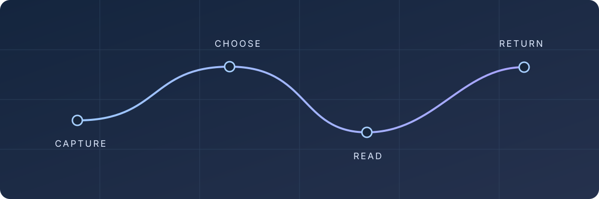
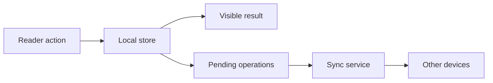
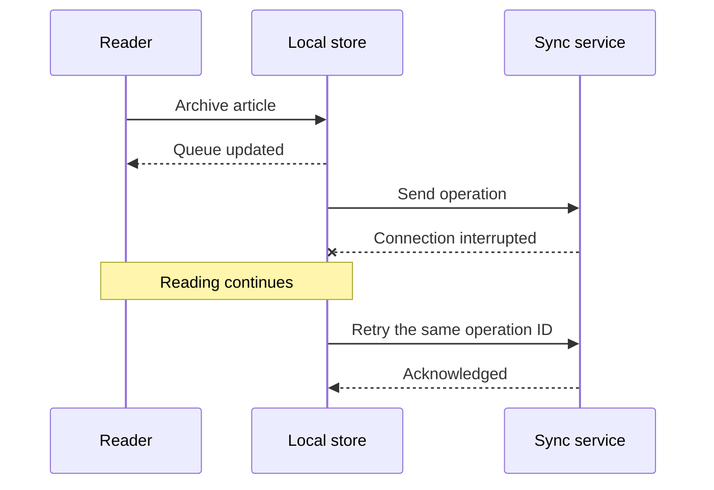

# Designing a calmer reading queue

A small design note about local-first software, careful defaults, and the pleasure
of finishing one thing before starting another.

**Field notes · September 2026 · 6 minute read**



A reading queue is a promise to your future self. It should help you decide what
to read next without turning every saved article into another obligation. This
note sketches an implementation that is deliberately small enough to understand.

> Good defaults remove a decision. Great defaults leave you free to change it.

## Start with the experience

The reader opens immediately. The last position is already available on the
device, and a background request can bring in newer information later. Opening
an article should not depend on the network completing its work.

These three source lines belong to the same paragraph.
A single newline is a soft break, so the sentence continues here.
Only a blank line starts the next paragraph.

This is a separate paragraph, with enough space to make the change in thought
clear. Try editing it on the left: the preview updates before you save.

### What the interface promises

- A stable place to resume reading.
- A short, useful queue instead of an endless inbox.
- An explicit distinction between **saved here** and **synced elsewhere**.
- A reversible action when an item leaves the queue.

The initial scope is intentionally narrow:

- [x] Read from the local store first.
- [x] Keep the current article visible during refresh.
- [ ] Test the interrupted-sync path on a slow connection.
- [ ] Measure cold startup on an older device.

## Follow the data

The write path puts the user's action first. Persistence is immediate; network
work follows. The diagram shows the order, rather than the timing of any one
implementation.



Each operation has a stable ID. Retrying the same operation must have the same
result as sending it once.[^retry]

### A compact operation model

```typescript
type QueueOperation = {
  id: string;
  articleId: string;
  action: "save" | "archive";
  createdAt: number;
};

async function archive(articleId: string): Promise<void> {
  await database.transaction(async (tx) => {
    await tx.articles.archive(articleId);
    await tx.pending.add({
      id: crypto.randomUUID(),
      articleId,
      action: "archive",
      createdAt: Date.now(),
    });
  });
}
```

The transaction is the important boundary. If it fails, neither the local state
nor the outgoing operation should claim success. If the network fails afterward,
the local result is still useful.

## Put a budget on waiting

Let $T_{open}$ be the time from selecting an article to the first useful frame.
A simple model separates the parts we can measure:

$$
T_{open} = T_{read} + T_{parse} + T_{layout}
$$

Network time is absent because the first frame uses local data. That does not
make synchronization free; it moves that work away from the opening path.

For repeated measurements $t_1,\ldots,t_n$, report a distribution rather than a
single best run. The empirical mean is:

$$
\bar{t} = \frac{1}{n}\sum_{i=1}^{n} t_i
$$

| Boundary | Start | Observable result |
| :--- | :--- | :--- |
| Opening | Select an article | First readable paragraph |
| Restoring | Mount the reader | Previous position is visible |
| Saving | Change the queue | State survives restart |
| Syncing | Send a pending operation | Other device sees the change |

These are measurement boundaries, **not benchmark results**. A fast parser does
not prove that an entire interaction feels fast.

## Design the failure path

A failed request should not empty the reader or move the current selection.
The user can continue reading while the application retries in the background.



### Keep the recovery understandable

1. Retain the original operation ID.
2. Retry with a bounded delay.
3. Show an error only when the user needs to act.
4. Keep a manual retry available.

~~Hide the queue until refresh completes.~~ Keep the current queue visible and
apply the new state when it arrives.

A plain URL is also a link in GFM: https://commonmark.org/help/.
The [measurement section](#put-a-budget-on-waiting) is a local heading link.

## A useful stopping point

The first version is done when someone can save an article, reopen the app,
resume reading, and archive it without thinking about where the data lives.

Measure those actions before adding more features. Keep the implementation
small, the feedback immediate, and the reading surface calm.

---

To explore this document in Med, turn on **Preview**, enter Vim Insert mode with
`i`, and change a sentence or a diagram label. Use `:w` to save, `u` to undo in
Normal mode, and `G` to test how the preview follows the cursor. The table of
contents appears when the preview pane has enough width.

[^retry]: An operation can arrive more than once even when the sender issued it
    only once. Treat retries as part of the normal delivery path.
