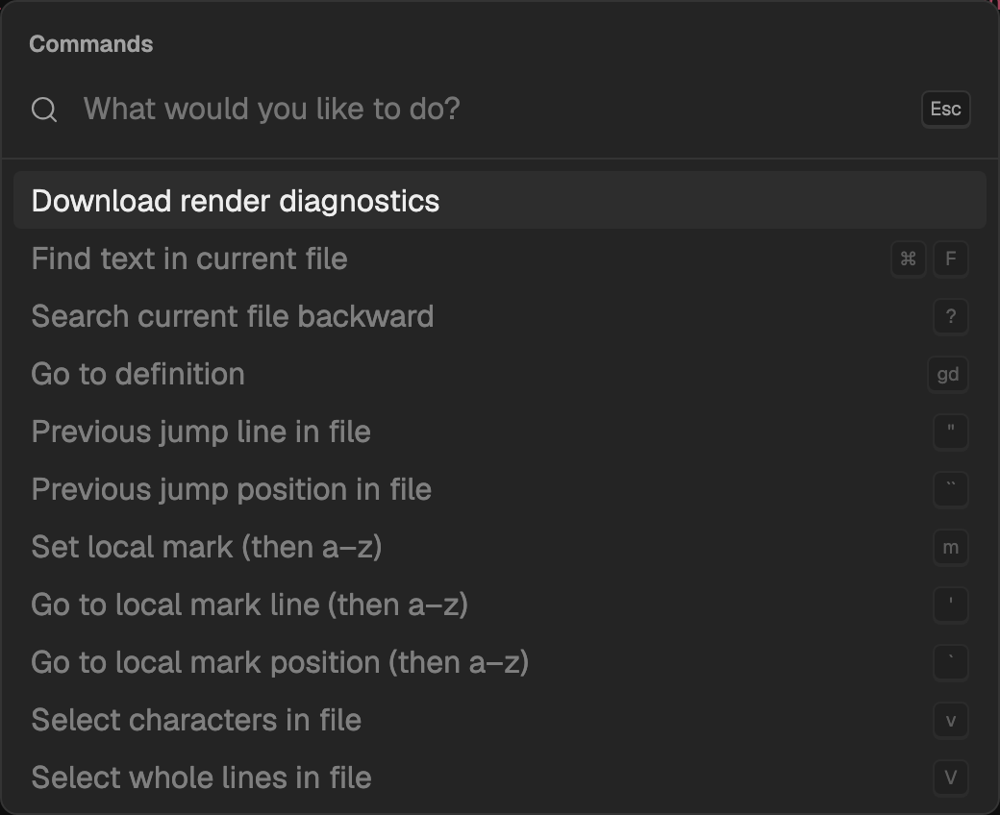
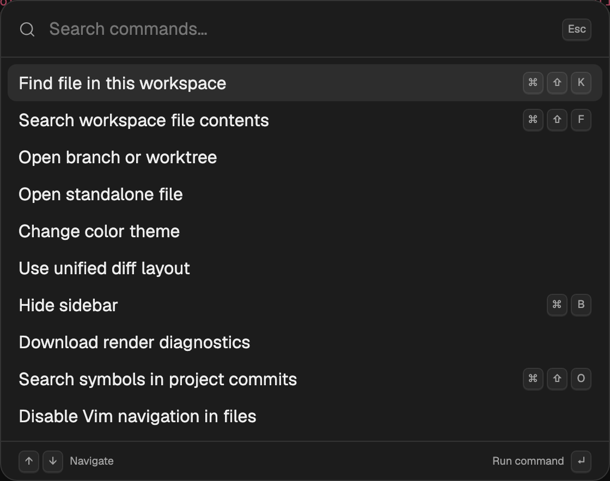
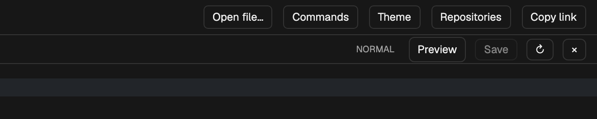
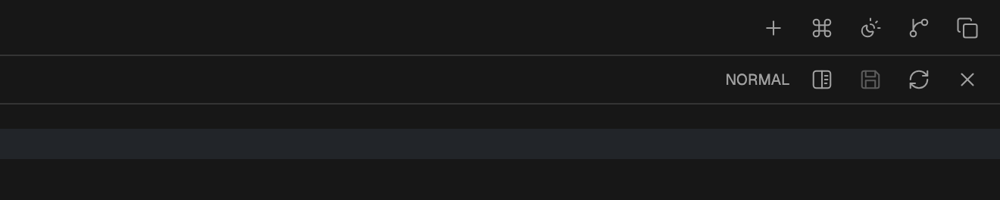
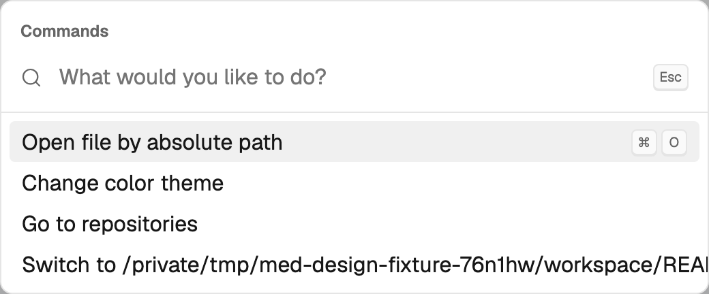
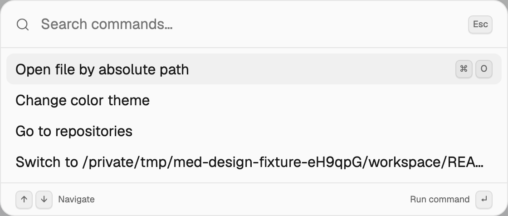
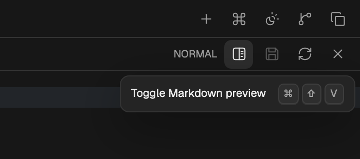

# Palette and toolbar design

The palette takes its rounded surface, inset rows, and quiet keyboard hints from
[Raycast](https://www.raycast.com/blog/launch-week-summary). The supplied Codex
screenshots informed the restrained borders and utility controls. Med retains
its themes, typography, layout, and file preview.

- Use 16 px corners for palettes, 12 px for menus, and 7 px for utility buttons.
- Use 34 px command rows and 28 px icon targets. Keep the editor header at 32 px.
- Keep primary and ambiguous actions labelled. Use named icons for familiar
  utility actions. Do not use Unicode characters as toolbar icons.
- Tooltips share a 400 ms first-hover delay and a 500 ms scan window. Keyboard
  hints use the same `kbd` component in palettes, menus, and tooltips.
- Keep focus indicators and accessible names on icon buttons. A toggle has a
  pressed state. Press animation respects reduced motion.
- Command rows use text and shortcut keycaps without icons. Common commands come first; unavailable commands remain searchable below them.
  Long labels truncate instead of displacing shortcuts.

## Close-ups

The same small Git fixture, viewport, and Graphite theme are used on each side.
Screenshots are captured directly from the production build at 2x resolution.

| Element          | Before                                             | After                                            |
| ---------------- | -------------------------------------------------- | ------------------------------------------------ |
| Command palette  |        |        |
| Utility toolbars |        |        |
| Light palette    |  |  |

## Verification

From `apps/med`, run `bun run build`, `bun run lint`, then
`node scripts/validate-visual-controls.mjs`. The script uses a temporary Git
repository and separate state directory. It checks menu focus restoration,
command-to-theme navigation, accessible shortcut tooltips, preview toggling from
the toolbar, stable toolbar height, and light/dark rendering. It closes its
browser and server. `MED_VISUAL_OUTPUT` changes the screenshot directory.

`MED_EXECUTABLE=/path/to/previous/med MED_VISUAL_BASELINE=1` captures the baseline.
The existing `validate-editor-interactions.mjs` checks editor selection, clipboard,
shortcuts, and blame through the production application.
