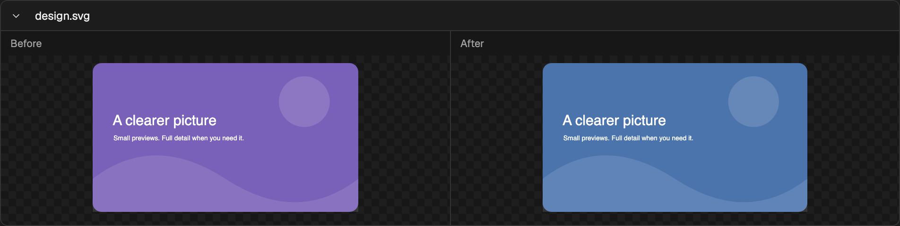
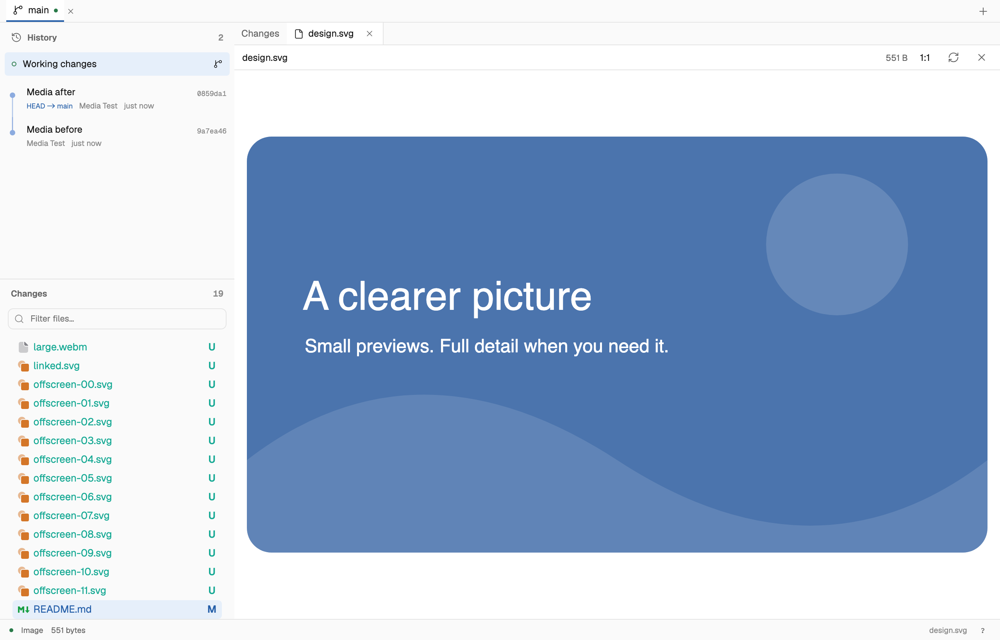
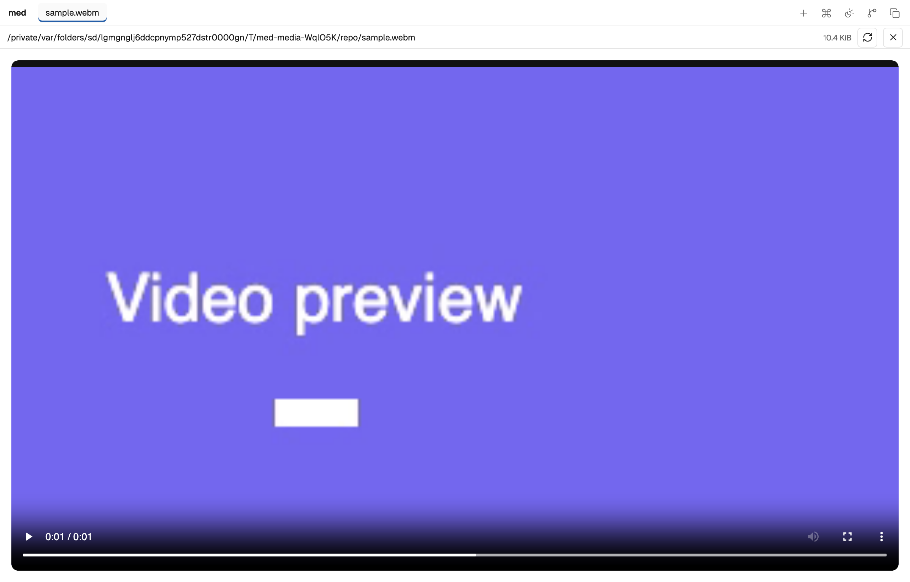

# Media viewing validation

Production build, Chromium, macOS Apple Silicon. Run `bun run build`, then
`bun run test:media` from `apps/med`. No encoder or external service is required.
Fixtures are synthetic and stay under 32 KiB in total. The script creates an
isolated Git repository and host, then closes both host and browser.

## User-visible behavior

- Image diffs stay below 240 px per card, with labelled before/after versions.
- Filenames open the normal file viewer. Headers collapse the whole card.
- SVG, PNG, JPEG, WebP, and AVIF decode in the actual browser.
- File images fit the pane; native video controls play, pause, and seek.
- Offscreen image elements are absent, then load when scrolled into view.
- Saved image snapshots stay unchanged after working files change. Commit,
  rename, deletion, and file-pair sources use their correct versions.
- Working image reads reject stale snapshots. Authentication, exact local-file
  grants, and symlink boundaries are enforced. SVG scripts do not execute.
- Dropped images use browser object URLs without a host media request.

## Bounded transfer check

A sparse **512 MiB** working video was opened through the production API. The
metadata response was **402 bytes** and contained no file bytes. A range near the
end returned exactly **64 KiB**, with a valid 206 response and Content-Range.
Suffix ranges, invalid ranges (416), HEAD, and committed video ranges passed.

Two local runs exercised the same bounded read:

| Runtime | Metadata | 64 KiB seek | Server RSS change |
| --- | --- | --- | --- |
| Node production host | 23.8 ms | 12.0 ms | 1.66 MiB |
| Bun standalone executable | 26.9 ms | 17.9 ms | 13.12 MiB |

These are bounded-I/O checks, not a latency benchmark or peak-memory measurement.
RSS is sampled before and after the requests and excludes browser/GPU memory.
Working files seek directly; Git may decompress a prefix before a later range.
The executable passed the same decoder, playback, snapshot, and access checks.
The Node check also combines code and images in one virtualized diff stream.

[Node results](media/results.json), [standalone results](media/standalone-results.json). The script also writes a Playwright trace to
`/private/tmp/med-media-results/media-trace.zip` for request and UI inspection.
`MED_MEDIA_OUTPUT` changes that output directory.

Build and lint passed, along with 36 host integration tests and the production
review-link, local-file, editor-interaction, and Markdown checks. Format support
beyond the tested formats depends on the browser. No video transcoding runs.
