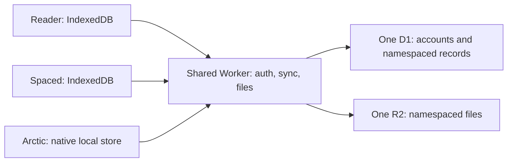

# Shared auth, sync, and file service

Status: local Reader and Spaced implementation recovered onto current main,
3 October 2026.
See the [local service guide](../apps/sync-server/README.md) for commands and limits.
Arctic remains outside this implementation. No production inventory, export,
migration, deployment, or client cutover has run. The production steps below
remain a plan.

## Decision

Create one backend for Reader, Spaced, and Arctic. Give each app a stable namespace:
`reader`, `spaced`, and `arctic`. These names are independent of repository folders,
Worker names, and product labels. `apps/spaced2` therefore uses `spaced`.

Use one Better Auth account store, one Cloudflare Worker, one D1 database, and one
R2 bucket. Keep each app's local database and domain model. The server stores
opaque records; it does not import app schemas or implement reading/review logic.

Proposed location: `apps/sync-server`. Proposed public origin: `api.zsheng.app`.
The origin and resource names are proposals; availability has not been checked.
Reader and Spaced keep their existing frontend origins and release separately.
Their Workers can continue to serve assets, but the shared Worker owns all auth,
sync, file, and device APIs.



One D1 is a reasonable starting point for this single-user service. It introduces
one shared availability and load boundary. Keep sync batches bounded so large
restores do not dominate other requests. Measure actual data size and restore
cost before cutover; one D1 executes queries serially. App namespaces also provide
a future partition boundary if measured load requires separate databases.
[Cloudflare D1 limits](https://developers.cloudflare.com/d1/platform/limits/)

## Current implementation

The initial plan inspected main at `99b09e8`. The local implementation from
`codex/shared-sync-local` was recovered onto `bab4718` in
`codex/shared-sync-resume`. Unrelated Reader cleanup and native work remain in
the original worktree.
The table describes the existing deployment configuration.

| App    | Auth and remote storage in checked source                                                    | Local storage                                                |
| ------ | -------------------------------------------------------------------------------------------- | ------------------------------------------------------------ |
| Reader | Better Auth; `reader-db`; `epub-reader-books`                                                | Dexie domain rows, outbox, separate local file/cache tables  |
| Spaced | Separate Better Auth; `spaced2-v2`; `spaced2-files-v2`                                       | `SpacedRecordsV3`, operation projection, `ImageCacheV2`      |
| Arctic | Staged routes use Reader auth, separate `arctic-db`, and an Arctic prefix in Reader's bucket | Live JSON library; staged sync journal is not the live store |

Reader and Spaced already consume `packages/local-sync`. Arctic's Swift transport
implements the same record protocol. The legacy adapter's D1 uniqueness is
`(user_id, key)` and pull filtering is by user alone. Combining databases without
changing these queries would mix app streams and can break client decoding.

Reader and Spaced also have nearly identical generic file-server implementations.
Both use `xxh64:` file IDs. Arctic uses `sha256:` IDs and an 8 MiB HTML limit.
Spaced has email verification and a legacy password verifier; Reader has a simpler
auth configuration. These are explicit consolidation choices, not interchangeable
configuration files.

Evidence paths, relative to the main checkout:

- `apps/reader/docs/ARCHITECTURE.md`, `server/db/schema.ts`, `server/lib/auth.ts`
- `apps/spaced2/ARCHITECTURE.md`, `server/index.ts`, `server/lib/auth.ts`
- `apps/spaced2/server/lib/password.ts`, `src/lib/db/persistence.ts`
- `packages/local-sync/src/hono/d1.ts`, `src/hono/index.ts`, `src/client.ts`
- `packages/arctic-sync-server/README.md`, `routes.ts`, `native-auth.ts`
- `apps/arctic/README.md`, `Sync/PERFORMANCE.md`

These are source/configuration findings. Current remote row counts, account IDs,
file completeness, and deployment state must be checked during migration preflight.

## Namespace contract

The complete record identity is `(authenticated user, namespace, existing key)`.
For example, Reader's `notes/abc` and another app's `notes/abc` are independent.
Do not concatenate app names into user IDs or require every domain key to change.

The shared host has a small static app registry. It validates the route namespace
against that registry and authenticates the user. Unknown namespaces fail; no
missing-namespace fallback exists. D1 queries receive the complete scope from the
host. A request body can never supply or override its authenticated user.

Apply the scope to push, winner lookup, pull, streamed pull, head calculation,
file listing, file download, and deletion. Filtering only the returned records is
insufficient: the indexes, uniqueness rules, and query predicates must be scoped.

Proposed logical schema:

```text
Better Auth user / account / session / verification
sync_streams(user_id, namespace, epoch)       primary key (user_id, namespace)
sync_records(server_seq, user_id, namespace, key, value,
             schema_version, hlc_wall_time_ms, hlc_counter, device_id, is_deleted)
  unique (user_id, namespace, key)
  index  (user_id, namespace, server_seq)
file_storage(user_id, namespace, file_id, object_key, size, media_type,
             created_at, deleted_at)
  primary key (user_id, namespace, file_id)
client_devices(user_id, namespace, client_id, display metadata, last_active_at)
native_auth_flows / native_auth_codes
```

Keep global AUTOINCREMENT `server_seq` initially. Gaps caused by other apps are
valid. Each pull uses the maximum sequence and fixed pagination head from its own
scope, never another app's cursor. Preserve tombstones; do not add retention expiry.

A namespace is a data-partition boundary, not proof of which executable called
an API. With one trusted user and three first-party apps, one authenticated account
may access all three registered namespaces. CORS is not app authorization. If
untrusted apps are added later, add explicit namespace grants and scoped tokens.

Cross-app features must be explicit. For example, a Spaced card can retain a source
reference `{ namespace: "reader", key: "highlights/abc" }`. This does not cause
Spaced to sync Reader's whole library. Create a shared dataset only when multiple
apps deliberately adopt the same data contract. Do not merge notes, tags, or
settings merely because their names match.

## Shared auth

Use a single Better Auth instance at the shared API origin, with a small sign-in
page. Each web app checks that service's session and sends API requests with
`credentials: include`. Sign-in returns to an allowlisted app URL. Google has one
callback at the shared origin. Preserve email sign-in if desired, but use one
password/verification policy and neutral verification email text.

Prefer a Secure, HttpOnly, host-only session cookie on the API host. All three web
clients use that same destination; they do not need to read or receive the cookie
on their own hosts. HTTPS sibling subdomains are same-site but cross-origin.
Configure exact CORS origins, credential support, OPTIONS, required headers, and
Better Auth trusted origins. Apply origin/CSRF checks to cookie-authenticated
mutations as well as auth routes. Do not use wildcard trusted subdomains.

This is a proposed application of normal cookie/fetch rules; verify it in Safari
and installed PWAs before release. Do not broaden the cookie domain by default.
Cross-subdomain cookies remain an option if later server-rendered apps need them.
[MDN Fetch](https://developer.mozilla.org/en-US/docs/Web/API/Fetch_API/Using_Fetch),
[MDN same-site versus origin](https://developer.mozilla.org/en-US/docs/Web/HTTP/Guides/Fetch_metadata),
[Better Auth cookies](https://better-auth.com/docs/concepts/cookies)

Move Arctic's native browser/PKCE handshake into this shared service. Keep fixed
registered native callbacks, single-use exchange codes, and Keychain credentials.
Update its hardcoded cookie-name/origin assumptions together with the server.
Each native installation signs in separately; shared accounts do not imply shared
browser/Keychain sessions. Global logout revokes the browser session used by the
web apps; other installations are revoked through the shared session UI.

Keep existing local data on session expiry or logout. Stop/cancel sync and reject
late responses from the previous session/account. Recheck the session on foreground
and on authorization failure; sibling origins cannot rely on localStorage events
for immediate logout notification.

## Sync protocol and local state

Introduce an explicit v3 endpoint contract:

```text
/api/auth/*
/api/me
/api/apps/:namespace/sync/v3/state
/api/apps/:namespace/sync/v3/push
/api/apps/:namespace/sync/v3/pull
/api/apps/:namespace/sync/v3/pull-stream
/api/apps/:namespace/files[/:fileId]
```

The state endpoint returns the authenticated scope and stream epoch. All sync
requests carry the expected epoch; responses identify the same scope/epoch.
The server rejects a stale epoch before reading/writing records. Streaming checks
the same contract. Freeze writes during an epoch reset; do not mutate epochs under
an active stream. Domain `schemaVersion` remains independent of protocol version.

Bind each client instance, durable state, outbox, lock, and local-store ownership
to `(server origin, user ID, namespace)`. Save its epoch beside the cursor.
A server replacement requires an explicit recovery/migration path, not an automatic
push of whatever happens to be on the device.

For this known migration, retain local domain data and pending outboxes, switch the
verified owner/scope, clear the old pagination head, reset `pullCursor` to zero and
`bootstrapped` to false, and run a complete pull. Preserve HLC state and original
pending-write versions. Do not turn downloaded rows into new local mutations.
Observe remote clocks before issuing new versions. The first pull must include
this device's own rows. An unknown epoch change stops sync with recoverable state.

Do not reset a cursor alone when the local store belongs to another account.
Adopt existing unscoped browser stores only through the explicit single-user
migration receipt. For later accounts, use distinct local stores. Browser origins
remain unchanged, which avoids abandoning their IndexedDB and cached files.

Retain Spaced's short local-write lock, separate network lock, clock merge, and
stable active review card. Preserve Reader's offline writes and query invalidation.
The TypeScript engine remains independent of React, auth, and app schemas. Swift
implements the same v3 fixtures; it does not need to adopt TypeScript storage code.

## Files

Use one catalog and R2 bucket with keys of the form:

```text
users/<user-id>/apps/<namespace>/<algorithm>:<digest>
```

Retain both existing hash algorithms during this migration. Rehashing every EPUB,
cover, and flashcard image would expand the scope and require rewriting references.
Use SHA-256 manifests to verify copied bytes independently of existing file IDs.
Do not deduplicate across namespaces initially. A file deletion in Reader must
never delete Spaced's object, even if the file IDs match.

Keep upload size/media policies in the host registry and preserve existing app
limits. Verify the digest on upload; write bytes before the catalog row; retry
idempotently. D1 and R2 are not one transaction, so migration uses a resumable
manifest and verifies every copied object before switching readers. Keep saved
HTML inert. Defer automatic orphan collection and reference-counted shared files.

App-specific upload scheduling remains local. Arctic must persist upload intent,
upload content before publishing its reference, and restore HTML on demand.

## Single-user migration

Use a planned maintenance window and a fresh target D1/bucket. This avoids a
permanent compatibility layer or dual writes. Keep old stores available for rollback.
D1 supports SQL export/import; transform the exported rows into the new schema
rather than concatenating source SQL dumps.
[Cloudflare import/export](https://developers.cloudflare.com/d1/best-practices/import-export-data/)

1. **Inventory and rehearse.** Inspect live accounts, namespaces, row/tombstone
   counts, maximum clocks, file catalogs, referenced files, and local-only data.
   Record every active browser/native installation. Export private backups outside
   Git and produce a deterministic local migration manifest. Rehearse on copies.
2. **Drain and freeze.** Bring active devices online, finish pending sync/uploads,
   and capture any remaining local outboxes. Gate the old servers against writes
   and take final exports. Pause edits during cutover. Old or offline app versions
   must show an upgrade requirement when they reconnect; they must not resume an
   independent writable backend. Preserve their queued edits for explicit replay.
3. **Choose the account mapping.** Prefer the existing Reader user ID as canonical
   if live identity checks confirm it. Explicitly map each source account to that
   user; do not infer ownership from an unverified email. Deduplicate verified
   provider identities. Start fresh sessions. Prefer one fresh password/reset over
   permanently retaining two password policies or Spaced's legacy verifier.
4. **Load record winners.** Assign namespace from the source database, remap user
   ownership, and preserve keys, values, schema versions, HLCs, original device IDs,
   and tombstones. Allocate fresh server sequences and stream epochs. Never seed
   through ordinary client writes with fresh timestamps. Check device-ID collisions
   before import; if remapping is needed, include records, outboxes, and client state
   in that mapping so conflict ordering remains consistent.
5. **Copy files.** Copy active catalog objects and all required references to scoped
   target keys. Preserve IDs and metadata. Verify content hashes and sizes. Keep old
   catalogs/tombstones in the archive and map deletion state explicitly. Inventory
   Arctic's prefix even if its D1 is empty; local HTML may still need later upload.
6. **Switch the shared service and web apps.** Configure the new OAuth callback,
   central auth, API origin, namespaced routes, and v3 client migration. Require a
   fresh sign-in. Apply a durable migration receipt only after local ownership/state
   is migrated successfully. Replay preserved outboxes with their original versions.
7. **Prove restoration.** Compare source and target manifests per namespace,
   including deletion flags and versions. Restore into a fresh browser profile.
   Check Reader position, notes, highlights and EPUB bytes; check Spaced cards,
   reviews, images, due dates and offline grading. Test reconnect from an older
   client and a crash partway through local migration. Do not recompute FSRS state.
8. **Integrate Arctic separately.** First use the shared server with its isolated
   transport tests. Then replace the full-snapshot sync journal with transactional
   SQLite, migrate the live ArticleStore and add account/upload UI. Preserve legacy
   library files until migration commits. Verify real native sign-in, offline edits,
   second-device restore, and large-library latency. Jev keys never enter sync.
9. **Retire old writes, then resources.** Keep old endpoints read-only/upgrade-only
   and retain backups through verification. Delete resources only as a later explicit
   cleanup. Before new writes, rollback can restore old endpoints. After new writes,
   freeze the target and export/reconcile its delta before any rollback; merely
   switching URLs back would lose new work.

Arctic may have no remote records to merge. Confirm this live. Its local data
migration is required for working Arctic sync even if the backend merge succeeds.

## Implementation order and checks

| Slice                           | Main changes                                                            | Proof required                                                                                                                         |
| ------------------------------- | ----------------------------------------------------------------------- | -------------------------------------------------------------------------------------------------------------------------------------- |
| 1. Namespace and epoch protocol | `packages/local-sync` D1 adapter, transport contracts, state validation | Real database/routes: same key in two apps, winner lookup, tombstones, pagination/streaming isolation, stale epoch rejection           |
| 2. Shared backend               | `apps/sync-server`, auth/native handshake, file catalog, device routes  | One authenticated identity across namespaces; unknown app rejection; unauthenticated access denied; identical file IDs remain isolated |
| 3. Web clients                  | Reader and Spaced API/auth transports and local migration receipts      | Cross-origin login, offline writes, interrupted bootstrap, queued edits, logout/cancellation, fresh restore                            |
| 4. Migration tooling            | Export/transform/copy/verify with resumable private manifests           | Repeatable run, preserved record versions, exact file hashes, failure resume, rollback rehearsal                                       |
| 5. Cutover                      | Deployment config, OAuth settings, server gates, client releases        | Live restore and manifests match; old clients cannot write to a second backend                                                         |
| 6. Arctic live integration      | Swift v3 transport, SQLite store, ArticleStore bridge, account UI       | Shared protocol fixtures plus real Mac/iPhone flows and measured library performance                                                   |

Keep integration and end-to-end tests focused on these boundaries. Do not duplicate
all existing app behavior tests in the server package. Build/check affected consumers
because the protocol types change. No implementation build is needed for this plan.

The intended result is one account and one backend with independent app datasets.
Adding a fourth app means registering its namespace and supplying its local adapter
and domain codec; it does not require another auth system or sync server.
